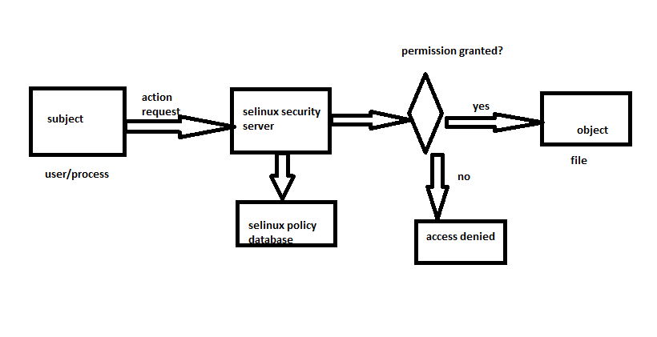

### 1
### What is operting system?

Operating system is an interface between user and the computer hardware. The hardware of the computer cannot understand the human readable language as it works on binaries i.e. 0's and 1's. Also it is very tough for humans to understand the binary language, in such case we need an interface which can translate human language to hardware and vice-versa for effective communication.

### Types of operating systems?

__Single User - Single Tasking Operating System__:  
In this type of operating system only one user can log into system and can perform only one task at a time.

E.g.: MS-DOS

__Single User - Multitasking Operating System__: This type of O/S supports only one user to log into the system but a user can perform multiple tasks at a time, browsing internet while playing songs etc.

E.g.: Windows.

__Multi User - Multitasking Operating System__:  
This type of O/S provides multiple users to log into the system and also each user can perform various tasks at a time. In a broader term multiple users can logged in to system and share the resources of the system at the same time.
E.g.: UNIX, LINUX etc.

### History of UNIX

In the beginning, there was AT&T. Bell Labs’ Ken Thompson developed UNIX in 1969 so he could play games on a scavenged DEC PDP-7. With the help of Dennis Ritchie, the inventor of the “C” programing language, Ken rewrote UNIX entirely in “C” so that it could be used on different computers. In 1974, the OS was licensed to universities for educational purposes. Over the years, hundreds of people added and improved upon the system, and it spread into the commercial world. Dozens of different UNIX “flavors” appeared, each with unique qualities, yet still having enough similarities to the original AT&T version. All of the “flavors” were based on either AT&T’s System V or Berkeley System Distribution (BSD) UNIX, or a hybrid of both.

### Flavors of unix:

Apple Computer’s A/UX  
IBM’s AIX  
AT&T’s System V Release 3  

### UNIX Principles  

* __Everything is a file__:- 

UNIX system have many powerful utilities designed to create and manipulate files. The UNIX security model is based around the security of files. By treating everything as a file, you can secure access to hardware in the same way as you secure access to a document.

* __Configuration data stored in text__: - 

Storing configuration in text allows an administrator to move a configuration from one machine to another easily, provide the ability to roll back a system configuration to a particular date and time.
* __Small, Single-Purpose Programs__: - 

UNIX provides many utilities.

* __Avoid captive user interfaces__

* __Ability to chain programs together to perform complex tasks__:- 

A core design feature of UNIX is that output of one program can be the input for another. This gives the user the flexibility to combine many small programs together to perform a larger, more complex task.

### What is LINUX

LINUX was developed in 1991 by linux torvalds. LINUX is a UNIX like operating system. LINUX is the best-known and mostly used opensource operating system built around the linux kernel. Typically, Linux is used for both desktop and srver's.

### What is Opensource

Opensource software is a computer software with it's source code made available with a license in which the copyright holder provides the righjts to study, change and destribute the software to anyone and for any purpose.

### Why LINUX?

Fresh implementation of UNIX APIs
Open source development model
Supports wide variety of hardware
Supports many networking protocols and Configurations
Fully supported

### Difference between linux and windows

```
LINUX                                    WINDOWS  

1. full access                           1. no access

2. licensing freedom                     2. licensing restrictions

3. online peer support                   3. paid helpdesk support

4. hardware support is full              4. hardware support is partial

5. command line                          5. no commandline

6. centralized application installation  6. non centralized application installation

7. multi-layered run levels              7. single layered run level. 
```

### 2

### Artichecture of the linux system  


### hardware:  

hardware consistes of pheriphiral devices like cpu, ram, hdd etc.


### kernel: 

kernel is the core component of the operating system, it iteracts directly with the hardware, and provides the low level servvice to upper layer componet.

Main tasks in kernel:
 
  1. process management
  2. device management
  3. memorry management
  4. interrupt handling 
  5. I/O operations
  6. file system etc. 

### shell: 

an interface to kernel, hiding complexity of kernel functions from users. actually shell takes commands from the user and execute the as kernel functions.

Types of shells: 

 bash : stands for bourne again shell
 
 sh : bourne shell
 
 Ksh : Korn shell
 
 csh: c shell
 
 tcsh: advanced c shell

example:
```
To find the default shell 
`echo $SHELL`
To find the available shells
cat /etc/shells
```
###  utilities:

in simple terms as user is the one who operates those utilities(programs).


### Filesystem Heirarchy:

/ :
* this is called single rooted, inventery tree
* this is the parent directory for all other directories.
* it is also called as root directory.
* represents in forward slash.

/bin: bin is nothing but binaries
* it contains commands used by other users(normal users)

/sbin:
* it contains commands used by super user(root)

/home:
* this is the home directory for other users(normal users)
* it provides the working environment for other users.

/root:
* this is the home directory for root user.
* it provides the working environment for root user.

/boot:
* it conatains bootable files like grub, initrd

/etc:
* it contains configuration files
like   

  /etc/ssh/sshd_config  
  /etc/passwd

/usr:
* by default softwares are installed in /usr directory.

/opt:
* it is an optional derectory for /usr
* it conatains third party softwares

/dev: 
* it contains device files
like /dev/hda
     /dev/cd rom

/proc:

* it contains process files
* it's contents are not permanent, they keep changing
* it is also called virtual directory
```
/proc/meminfo - ram and swap
/proc/cpuinfo  - cpu
```

/var:
* in linux every event is generated as a message. those messages are stored in /var
* it contains variable data 

/mnt:
* this is default mount point for any partition.
* by default it is empty.

/media:
* it contains all or removable media like cd rom or pen drive

/lib:
* it contains library files.
* library files are used by os.

### What is Path

* a path is a unique location to a file or directory in the file system of a linux.
* paths are two types
1. absolute path:
absolute path is a complete path to a file or directory in the file system of a linux. 

2. relative path:
relative path is a path from current working directory is simple terms it is relate to working directory.

* Example:
```
# create a file and add `welcome to linux text to that file` 
cat > file1
welcome to linux
# to save the file `press ctrl + d`

# see the contents of a file1 by using absolute path 
cat /home/ubuntu/file1

# see the contents of a file1 by using relative path
cat file1
```
### 3

### Basic Commands

__cat__:

* cat stands for concatenation
* it is used to creare, show and append the text to a file.
* example:
```
1.# to create a file
cat > file1
hello
# to save the content of a file press `ctrl + d`
2. # to show the content of a file
cat file1
3. to append a text to a file
cat >> file1
welcome to linux
# to save the content of a file press `ctrl + d`
```

__touch__:

* touch command is used to create empty files
* examples:
```
# create a empty file
touch file2

# create multiple empty files
touch file3 file4 file5

# create a sequence of files
touch file{6..10}
``` 
__mkdir__:

* mkdir stands for make directory
* it is used to create directories
* examples
```
# create a directory
mkdir dir1

# creare multiple subdirectories
mkdir -p dir1/dir2/dir3

# creae multiple directories along with subdirectories
mkdir -p os/{linux/{ubuntu,centos},windows/{windows7, windows10},mac}

```

__cp__:

* cp stands for copy
* it is used to copy the files and directories 
* examples
```
# create two directories
mkdir demo1
mkdir demo2
# create a file 
touch test1

# to copy test1 file into a demo1 directory
syntax:
cp <source> <destination>
cp test1 demo1

# to copy demo1 directory into demo2 directory
cp -rvfp demo1 demo2

# to see the directory structure into a tree format
# ubuntu 
sudo apt-get update
sudo apt-get install tree -y

#centos
sudo yum update
sudo yum install tree -y

# after you installed the tree just execute this command for see the directory structure into tree format
tree demo2
```
__mv__:

* mv stands for move
* it is used to move a file or directory into another directory.

```
# to cut and paste a file into a directory
mv test1 demo2

# to cut and paste a directory into another directory
mv demo2 demo1

# to rename a file or directory
mv <oldname> <newname>
# to rename demo1 to dir1
mv demo1  dir1
```
Next class
* rmdir
* rm
* ls


### 4

### Basic Commands

__rmdir__:

* rmdir is stands for remove directory
* it is used to remove `empty` directories
* example:
```
# create a directory named as dir1
mkdir dir1
# remove the directory by using rmdir
rmdir dir1
```
__rm__:

* rm stands for remove
* it is used to remove files and directories
* example:
```
# create a directory named as dir1
mkdir dir1
# create some files and directories inside dir1
cd dir1
touch file1 file2
mkdir dir2
# remove the directory by using rmdir
rmdir dir1

# to remove the above directory dir1 
rm -rf dir1
where 
r  for recursive
f  for forccefully
```
__ls__:

* ls stands for listing 
* it is used to display the files and directories
* example:
```

# create some files and directories
touch file{1..5}
mkdir dir1
mkdir dir2
touch test
touch demo1 demo2

# list the files and directories in current directory
ls

# to display the file and directories in long listing format 
ls -l 

# to display all the files(with hidden)
ls -a

# to display the all files with long listing format
ls -al

# to display a particular file in a long listing format
ls -l file1

# to display a particular directory in a long listing format
ls -ld dir1

# to display the files start with first letter `f`
ls f*

# to display the files with first letter is any and remaining are some format
ls ?est

# to display the files with first letter is `f` or `t`
ls [ft]*

# to display the files without first letter is `f` or `t`
ls [!ft]*  

# to display the file and directories of a particular directory
ls /

# to display the files and directories in long listing format
ll

# to display the files and directories in a particular directory with long listing format
ll /
```

__cd__:

* cd stands for change directory
* it is used to change from one directory to another directory
* example:
```
syntax
cd <directoryname>

# to change the current directory to dir1 directory
cd dir1

# to change the previous directory
cd -

# to change the parent directory right now i am in `/home/ubuntu/dir1`
cd ..
cd ..
cd ..

# to change the current working directory to user home directory
cd ~

```
__pwd__:

* pwd stands for print working directory
* it is used to know the current working directory
* example:
```
pwd
```

__whoami__:

* it is used to know the current working user
* example:
```
whoami
```
__exit__ or __logout__:

* it is used to logged out into a particular user.
* example:
```
sudo -i
logout or exit
```
__ifconfig__:

* it is used to display the machine ip address
* example:
```
ifconfig
```

__hostname__:

* it is used to display the hostname of a machine
* example:
```
hostname
```
__su__: 

* su stands for switch user
* it is used to switch from one user to another user.
* example:
```
# to switch from current user to root user
sudo -i or sudo su -

# to switch from current user to some other user along with home directory
sudo -i
su - ubuntu

# to switch from current user to some other user without home directory
sudo -i
su ubuntu
``` 
### 5


### Filter Commands

__less__:

* less command is used to display the file content in linewise 
* example:
```
less /etc/passwd
```

__more__:

* less command is used to display the file content in page wise
* example:
```
more /etc/passwd
```

__head__:

* head is used to display the top lines in a file 
* default line number is 10.
* we can also used to display custom number of lines in a file 
* example:
```
# display the actual content in a file
cat /etc/passwd

root:x:0:0:root:/root:/bin/bash
daemon:x:1:1:daemon:/usr/sbin:/usr/sbin/nologin
bin:x:2:2:bin:/bin:/usr/sbin/nologin
sys:x:3:3:sys:/dev:/usr/sbin/nologin
sync:x:4:65534:sync:/bin:/bin/sync
games:x:5:60:games:/usr/games:/usr/sbin/nologin
man:x:6:12:man:/var/cache/man:/usr/sbin/nologin
lp:x:7:7:lp:/var/spool/lpd:/usr/sbin/nologin
mail:x:8:8:mail:/var/mail:/usr/sbin/nologin
news:x:9:9:news:/var/spool/news:/usr/sbin/nologin
uucp:x:10:10:uucp:/var/spool/uucp:/usr/sbin/nologin
proxy:x:13:13:proxy:/bin:/usr/sbin/nologin
www-data:x:33:33:www-data:/var/www:/usr/sbin/nologin
backup:x:34:34:backup:/var/backups:/usr/sbin/nologin
list:x:38:38:Mailing List Manager:/var/list:/usr/sbin/nologin
irc:x:39:39:ircd:/var/run/ircd:/usr/sbin/nologin
gnats:x:41:41:Gnats Bug-Reporting System (admin):/var/lib/gnats:/usr/sbin/nologin
nobody:x:65534:65534:nobody:/nonexistent:/usr/sbin/nologin
systemd-network:x:100:102:systemd Network Management,,,:/run/systemd/netif:/usr/sbin/nologin
systemd-resolve:x:101:103:systemd Resolver,,,:/run/systemd/resolve:/usr/sbin/nologin
syslog:x:102:106::/home/syslog:/usr/sbin/nologin
messagebus:x:103:107::/nonexistent:/usr/sbin/nologin
_apt:x:104:65534::/nonexistent:/usr/sbin/nologin
lxd:x:105:65534::/var/lib/lxd/:/bin/false
uuidd:x:106:110::/run/uuidd:/usr/sbin/nologin
dnsmasq:x:107:65534:dnsmasq,,,:/var/lib/misc:/usr/sbin/nologin
landscape:x:108:112::/var/lib/landscape:/usr/sbin/nologin
sshd:x:109:65534::/run/sshd:/usr/sbin/nologin
pollinate:x:110:1::/var/cache/pollinate:/bin/false
ubuntu:x:1000:1000:Ubuntu:/home/ubuntu:/bin/bash

# by using head display top 10 lines
head /etc/passwd

root:x:0:0:root:/root:/bin/bash
daemon:x:1:1:daemon:/usr/sbin:/usr/sbin/nologin
bin:x:2:2:bin:/bin:/usr/sbin/nologin
sys:x:3:3:sys:/dev:/usr/sbin/nologin
sync:x:4:65534:sync:/bin:/bin/sync
games:x:5:60:games:/usr/games:/usr/sbin/nologin
man:x:6:12:man:/var/cache/man:/usr/sbin/nologin
lp:x:7:7:lp:/var/spool/lpd:/usr/sbin/nologin
mail:x:8:8:mail:/var/mail:/usr/sbin/nologin
news:x:9:9:news:/var/spool/news:/usr/sbin/nologin


# to display the custom number of lines in a file
syntax:
head -n <filename>
where 
n  - is any number

# to display the first 8 lines of a file
head -8 /etc/passwd

root:x:0:0:root:/root:/bin/bash
daemon:x:1:1:daemon:/usr/sbin:/usr/sbin/nologin
bin:x:2:2:bin:/bin:/usr/sbin/nologin
sys:x:3:3:sys:/dev:/usr/sbin/nologin
sync:x:4:65534:sync:/bin:/bin/sync
games:x:5:60:games:/usr/games:/usr/sbin/nologin
man:x:6:12:man:/var/cache/man:/usr/sbin/nologin
lp:x:7:7:lp:/var/spool/lpd:/usr/sbin/nologin

```
__tail__:

* talis is used to display the last lines in a file
* default line number is 10
* we can also display custom number of lines by passing the `-n` where n is any number.
* example:
```
# to display last 10 lines in a file
tail /etc/passwd

syslog:x:102:106::/home/syslog:/usr/sbin/nologin
messagebus:x:103:107::/nonexistent:/usr/sbin/nologin
_apt:x:104:65534::/nonexistent:/usr/sbin/nologin
lxd:x:105:65534::/var/lib/lxd/:/bin/false
uuidd:x:106:110::/run/uuidd:/usr/sbin/nologin
dnsmasq:x:107:65534:dnsmasq,,,:/var/lib/misc:/usr/sbin/nologin
landscape:x:108:112::/var/lib/landscape:/usr/sbin/nologin
sshd:x:109:65534::/run/sshd:/usr/sbin/nologin
pollinate:x:110:1::/var/cache/pollinate:/bin/false
ubuntu:x:1000:1000:Ubuntu:/home/ubuntu:/bin/bash

# to display the last 5 lines in file
syntax:
tail -n <filename>
where 
n  - is any number

tail -5 /etc/passwd

dnsmasq:x:107:65534:dnsmasq,,,:/var/lib/misc:/usr/sbin/nologin
landscape:x:108:112::/var/lib/landscape:/usr/sbin/nologin
sshd:x:109:65534::/run/sshd:/usr/sbin/nologin
pollinate:x:110:1::/var/cache/pollinate:/bin/false
ubuntu:x:1000:1000:Ubuntu:/home/ubuntu:/bin/bash

```

__sort__:

* it is used to sort the output in numeric or alphabetic order.
* example:
```
syntax:

sort <options> <filename>

# create a file with some content

vi file2

Welcome to Linux
Welcome to linux
Welcome to LINUX
Linux is OpenSource Operating System
Linux is OpenSource Operating System
Linux is OpenSource Operating System

# to sort the above file
sort file2

Linux is OpenSource Operating System
Linux is OpenSource Operating System
Linux is OpenSource Operating System
Welcome to LINUX
Welcome to Linux
Welcome to linux

# to sort the above file in dictionary order
sort -d file2

Linux is OpenSource Operating System
Linux is OpenSource Operating System
Linux is OpenSource Operating System
Welcome to LINUX
Welcome to Linux
Welcome to linux


# to sort the above file in human numeric order
# this is file2 content
cat file2
4.Welcome to Linux
2.Welcome to linux
3.Welcome to LINUX
1.Linux is OpenSource Operating System
6.Linux is OpenSource Operating System
5.Linux is OpenSource Operating System

# sort -h file2
1.Linux is OpenSource Operating System
2.Welcome to linux
3.Welcome to LINUX
4.Welcome to Linux
5.Linux is OpenSource Operating System
6.Linux is OpenSource Operating System

# to display the unique lines in a file
cat file2
Welcome to Linux
Welcome to linux
Welcome to LINUX
Linux is OpenSource Operating System
Linux is OpenSource Operating System
Linux is OpenSource Operating System

# to display the unique lines along with sorting.
sort -u file2

Linux is OpenSource Operating System
Welcome to LINUX
Welcome to Linux
Welcome to linux
```

__cut__:

* cut is used to pick the given expression(in columns) and display the output.
* example:
```
cat /etc/passwd

root:x:0:0:root:/root:/bin/bash
daemon:x:1:1:daemon:/usr/sbin:/usr/sbin/nologin
bin:x:2:2:bin:/bin:/usr/sbin/nologin
sys:x:3:3:sys:/dev:/usr/sbin/nologin
sync:x:4:65534:sync:/bin:/bin/sync
games:x:5:60:games:/usr/games:/usr/sbin/nologin
man:x:6:12:man:/var/cache/man:/usr/sbin/nologin
lp:x:7:7:lp:/var/spool/lpd:/usr/sbin/nologin
mail:x:8:8:mail:/var/mail:/usr/sbin/nologin
news:x:9:9:news:/var/spool/news:/usr/sbin/nologin
uucp:x:10:10:uucp:/var/spool/uucp:/usr/sbin/nologin
proxy:x:13:13:proxy:/bin:/usr/sbin/nologin
www-data:x:33:33:www-data:/var/www:/usr/sbin/nologin
backup:x:34:34:backup:/var/backups:/usr/sbin/nologin
list:x:38:38:Mailing List Manager:/var/list:/usr/sbin/nologin
irc:x:39:39:ircd:/var/run/ircd:/usr/sbin/nologin
gnats:x:41:41:Gnats Bug-Reporting System (admin):/var/lib/gnats:/usr/sbin/nologin
nobody:x:65534:65534:nobody:/nonexistent:/usr/sbin/nologin
systemd-network:x:100:102:systemd Network Management,,,:/run/systemd/netif:/usr/sbin/nologin
systemd-resolve:x:101:103:systemd Resolver,,,:/run/systemd/resolve:/usr/sbin/nologin
syslog:x:102:106::/home/syslog:/usr/sbin/nologin
messagebus:x:103:107::/nonexistent:/usr/sbin/nologin
_apt:x:104:65534::/nonexistent:/usr/sbin/nologin
lxd:x:105:65534::/var/lib/lxd/:/bin/false
uuidd:x:106:110::/run/uuidd:/usr/sbin/nologin
dnsmasq:x:107:65534:dnsmasq,,,:/var/lib/misc:/usr/sbin/nologin
landscape:x:108:112::/var/lib/landscape:/usr/sbin/nologin
sshd:x:109:65534::/run/sshd:/usr/sbin/nologin
pollinate:x:110:1::/var/cache/pollinate:/bin/false
ubuntu:x:1000:1000:Ubuntu:/home/ubuntu:/bin/bash

# syntax:
cut -options filename
options are
d - delimeter
f - field numbers

# to display the field number 7 in /etc/passwd file
cut -d : -f 7 /etc/passwd

# to display the files number 1,7 in /etc/passwd file
cut -d : -f 1,7 /etc/passwd

# create a file with some content like below
vi hello
hi,how,are,you

# using cut command display the second field.
cut -d , -f 2 /etc/passwd

# create a file with some content like below
vi hello
hi how are you

# using cut command display the second field.
cut -d " " -f 3 /etc/passwd
```

__sed__:

* sed stands for stream editor
* it is used to search a word in the file and replace it with the word required to be in the output.
* example:
```
ubuntu@ip-172-31-8-204:~$ cat file2
Welcome to Linux
Welcome to linux
Welcome to LINUX
Linux is OpenSource Operating System
Linux is OpenSource Operating System
Linux is OpenSource Operating System

ubuntu@ip-172-31-8-204:~$ sed 's/LINUX/LINUX OPERATING SYSTEM/g' file2 
Welcome to Linux
Welcome to linux
Welcome to LINUX OPERATING SYSTEM
Linux is OpenSource Operating System
Linux is OpenSource Operating System
Linux is OpenSource Operating System

ubuntu@ip-172-31-8-204:~$ cat file2
Welcome to Linux
Welcome to linux
Welcome to LINUX
Linux is OpenSource Operating System
Linux is OpenSource Operating System
Linux is OpenSource Operating System
ubuntu@ip-172-31-8-204:~$

```

Next Class:
* grep

* find

* file permissions


### 6

### Filter Commands

__grep__:

* grep stands for global regular expression print
* it is used to pick out the required expression from the file and print the output.
* example:
```
syntax:
grep options filename
options are:
i   - ignorecase
B   - before
A   - after
v   - invert match
n   - any number   

# create a file named as file2 and add some text
ubuntu@ip-172-31-8-204:~$ cat file2
Welcome to Linux
Welcome to linux
Welcome to LINUX
Linux is Opensource Operating System
Linux is opensource Operating System
Linux is OPENSOURCE Operating System

# search a word `linux` and display the output
ubuntu@ip-172-31-8-204:~$ grep linux file2
Welcome to linux


# search a word and display the output whether it is capital letter's or small letter's
ubuntu@ip-172-31-8-204:~$ grep -i linux file2
Welcome to Linux
Welcome to linux
Welcome to LINUX
Linux is Opensource Operating System
Linux is opensource Operating System
Linux is OPENSOURCE Operating System

# to display a word and 2 lines after the word
ubuntu@ip-172-31-8-204:~$ grep -nA2 Opensource file2
4:Linux is Opensource Operating System
5-Linux is openSource Operating System
6-Linux is OPENSOURCE  Operating System


# to display a word and 2 lines before the word
ubuntu@ip-172-31-8-204:~$ grep -nB2 Opensource file2
2-Welcome to linux
3-Welcome to LINUX
4:Linux is Opensource Operating System


# to display the lines except the given word
ubuntu@ip-172-31-8-204:~$ grep -v Welcome file2
Linux is Opensource Operating System
Linux is openSource Operating System
Linux is OPENSOURCE  Operating System

```

__find__:

* find command is used to find the files or directory's path, it is exactly like the find option in windows where you can search for a file.
* example:
```
syntax:
find <path> <options> <filename>

options are 
name   - for searching a file with it's name
inum   - for searching a file with particular inode number
type   - for searching a particular type of file
user   - for files whose owner is a particular user
group  - for files belonging to particular group

# create below files and directories
ubuntu@ip-172-31-8-204:~$ ls
dir1  file1  file2  hello

# finding a file with name
find / -name hello

# finding a file with it's inode number
ubuntu@ip-172-31-8-204:~$ ls -i
256092 dir1  256093 file1  280199 file2  256227 hello
ubuntu@ip-172-31-8-204:~$ sudo find / -inum 256093
/home/ubuntu/file1

# finding the files or directories by using type option
ubuntu@ip-172-31-8-204:~$ sudo find / -type f -name file1
/home/ubuntu/file1
ubuntu@ip-172-31-8-204:~$ sudo find / -type d -name dir1
/home/ubuntu/dir1

# finding the files, whose owner is "ubuntu"
ubuntu@ip-172-31-8-204:~$ sudo find / -user ubuntu
/var/lib/lxcfs/cgroup/name=systemd/user.slice/user-1000.slice/user@1000.service
/var/lib/lxcfs/cgroup/name=systemd/user.slice/user-1000.slice/user@1000.service/cgroup.procs
/var/lib/lxcfs/cgroup/name=systemd/user.slice/user-1000.slice/user@1000.service/tasks
/var/lib/lxcfs/cgroup/name=systemd/user.slice/user-1000.slice/user@1000.service/cgroup.clone_children
/var/lib/lxcfs/cgroup/name=systemd/user.slice/user-1000.slice/user@1000.service/init.scope
/var/lib/lxcfs/cgroup/name=systemd/user.slice/user-1000.slice/user@1000.service/init.scope/cgroup.procs
/var/lib/lxcfs/cgroup/name=systemd/user.slice/user-1000.slice/user@1000.service/init.scope/tasks
/var/lib/lxcfs/cgroup/name=systemd/user.slice/user-1000.slice/user@1000.service/init.scope/notify_on_release
/var/lib/lxcfs/cgroup/name=systemd/user.slice/user-1000.slice/user@1000.service/init.scope/cgroup.clone_children
/proc/1874
/proc/1874/task
/proc/1874/task/1874
/proc/1874/task/1874/fd
/proc/1874/task/1874/fd/0
/proc/1874/task/1874/fd/1

# finding the files, whose group is ubuntu 
ubuntu@ip-172-31-8-204:~$ sudo find / -group ubuntu
/var/lib/lxcfs/cgroup/name=systemd/user.slice/user-1000.slice/user@1000.service
/var/lib/lxcfs/cgroup/name=systemd/user.slice/user-1000.slice/user@1000.service/cgroup.procs
/var/lib/lxcfs/cgroup/name=systemd/user.slice/user-1000.slice/user@1000.service/tasks
/var/lib/lxcfs/cgroup/name=systemd/user.slice/user-1000.slice/user@1000.service/cgroup.clone_children
/var/lib/lxcfs/cgroup/name=systemd/user.slice/user-1000.slice/user@1000.service/init.scope
/var/lib/lxcfs/cgroup/name=systemd/user.slice/user-1000.slice/user@1000.service/init.scope/cgroup.procs
/var/lib/lxcfs/cgroup/name=systemd/user.slice/user-1000.slice/user@1000.service/init.scope/tasks
/var/lib/lxcfs/cgroup/name=systemd/user.slice/user-1000.slice/user@1000.service/init.scope/notify_on_release
/var/lib/lxcfs/cgroup/name=systemd/user.slice/user-1000.slice/user@1000.service/init.scope/cgroup.clone_children
/proc/1874
/proc/1874/task
/proc/1874/task/1874
/proc/1874/task/1874/fd
/proc/1874/task/1874/fd/0
/proc/1874/task/1874/fd/1
/proc/1874/task/1874/fd/2
/proc/1874/task/1874/fd/3

```   


next class
### File Permissions

### 7

### File Permissions

* file types:

```
-          ->       normal file
d          ->       directory
c          ->       character file
b          ->       block file
l          ->       link file
```

* to know the full detailes of a file

```
ubuntu@ip-172-31-6-120:~$ ls -l file1
-rw-rw-r-- 1 ubuntu ubuntu 0 Aug 10 04:53 file1

-           -> type of file
rw-         -> user/owner permissions 
rw-         -> group permissions
r--         -> others permissions
1           -> link count
ubuntu      -> owner of the file
ubuntu      -> group of the file
0           -> size of the file
Aug 10 04:53-> time stamp
file1   -> filename

```
* to know the full details of a directory
```
ubuntu@ip-172-31-6-120:~$ ls -ld dir1
drwxrwxr-x 2 ubuntu ubuntu 4096 Aug 10 04:53 dir1

d           -> type of file
rwx         -> user/owner permissions 
rwx         -> group permissions
r-x         -> others permissions
2           -> link count
ubuntu      -> owner of the file
ubuntu      -> group of the file
4096           -> size of the file
Aug 10 04:53-> time stamp
dir1   -> directory name
```

__umask :__

* when we create a file or directory defaultiy some permissions are applied based on umask
* umask(user file creation mask)
* it is 4 digit octal number
* which tells the unix which of the three permissions are to be denied rather than granted.
* example:
```
# to check umask of a normal user
umask
0002

# to  check the umask of root user
umask
0022
```

* permissions are applied into three level
```
owner level
group level
other's level
```
* access modes are three types 
```
r  - read 
w  - write 
x  - execute
```
* access modes are applied into file and directory in the following 
```
permission    file                               directory
r             open the file                      'ls' the contents of directory
w             write,edit,append and delete file   add,delete,and rename the contens of     directory 
x             to run a commad/shell script        to enter into other directories using `cd`
```


### permissions can be set into two types
1. symbolic method

* in symbolic method we are using symbols for changing the permissions of a file or directory
* symbols are
```
u   -  user
g   -  group
o   -  others   

+   -    to add the permissions
-   -    remove the permissions
=   -    to replace the permissions 
```
* example:
```
ubuntu@ip-172-31-6-120:~$ ls -ld dir1
drwxrwxr-x 2 ubuntu ubuntu 4096 Aug 10 04:53 dir1

ubuntu@ip-172-31-6-120:~$ chmod u-wx dir1
ubuntu@ip-172-31-6-120:~$ ls -ld dir1
dr--rwxr-x 2 ubuntu ubuntu 4096 Aug 10 04:53 dir1


```
2. absolute method 
* in absolute method we are using numbers for changing the permissions of a file or directory
* numbers are
```
read     -   4 
write    -   2 
execute  -   1
```
* example
```
ubuntu@ip-172-31-6-120:~$ ls -ld dir1
drwxrwxr-x 2 ubuntu ubuntu 4096 Aug 10 04:53 dir1

ubuntu@ip-172-31-6-120:~$ chmod 700 dir1
ubuntu@ip-172-31-6-120:~$ ls -ld dir1
drwx------ 2 ubuntu ubuntu 4096 Aug 10 04:53 dir1
```

### to calculate the default permission of a file and directory

```
full permissions of a file `6`
directory full permissions `7`
normal user umask  0002
root user umask  0022


# normal user default file permissions
   666
 - 002
--------
    664(rw-rw-r--)

# noraml user default directory permissions
   777
 - 002
 ------- 
   775(rwxrwxr-x) 

# root user default file permissions

   666
 - 022
--------
   644(rw-r--r--)

# root user default directory permissions
   777
 - 022
 ------- 
   755(rwxr-xr-x) 
```

### 8


### User Administration

* In linux/unix user is the one who uses the system.
* there can be atleast one or more than one users in linux machine at a time.
* the user's are identified by it's name and id
* id is the number and name is in string format
* name and id is unique in entire system
* two user's doesn't have same name and id.
* users cann't read, write, or execute other user's file without permissions.


### Types user's in linux:

1. super user or root user:
* super user or the root user is the most powerful user. 
* he is administrator user.
* super user has full permission of the linux system. 

2. system user

* system user are  the users created by the softwares or applications.
* for example, in ubuntu whenever `apache2` package is installed one user `www-data` created.
* in redhat whenever `httpd` package is installed one user `apache` created.
* these user's are not login into the system, these user's are process the software's.

3. normal user
* normal users are the users created by root user. they are noraml users like ubuntu, centos.

### Lab
* create a user and check the user details
```
# create a user in centos or ubuntu
useradd <username>
useradd ram

# to check the user is created or not by open /etc/passwd file
cat /etc/passwd
ram:x:1001:1001::/home/ram:/bin/bash
ram      - username
x        - link to password file
1001     - user id(uid)
1001     - group id(gid)
::       - description about the user
/home/ram - user's home directory
/bin/bash  - shell

```
__Note:__

* in ubuntu whenever the user is created by using useradd `user home directory` is not created.
* to overcome this we use `adduser <username>` command in ubuntu. this command set the password also.

###  whenver a user is created in linux things created by default

```
* a home directory is created (/home/ram)
* a mail box us created (/var/spool/mail)
* unique UID and GID are given to the user
* a user shell is created
* user name and user id are stored in /etc/passwd
* user password is stored in /etc/shadow
* user primary group is created in /etc/group
```

### Attributes in the user creation 

```
type      example          userid      groupid     home directory         shell
----      -------          -------     -------     ---------------        -----
superuser  root             0             0          /root                /bin/bash

sytemuser  ftp,ssh,apache  1 t0 499     1 t0 499    /var/ftp, /var/www/   /sbin/nologin
            nobody

normaluser  centos,ubuntu  500 t0 60000 500 t0 60000 /home/centos,/home/ubuntu  /bin/bash 

```


### 9

### User Administration

* create a user with custom values like 
```
name    = krishna
userid  = 1001
comment = admin
home directory = /krishna
shell = /bin/bash

# now lets create a user using the above values
root@ip-172-31-39-135:~# useradd krishna -u 1001 -d /krishna -s /bin/bash -c "Admin"
root@ip-172-31-39-135:~# tail -1 /etc/passwd
krishna:x:1001:1001:Admin:/krishna:/bin/bash
root@ip-172-31-39-135:~# tail -1 /etc/group
krishna:x:1001:

# to change the ownership of home directory
root@ip-172-31-39-135:~# chown krishna /krishna
root@ip-172-31-39-135:~# ls -ld /krishna
drwxr-xr-x 2 krishna root 4096 Aug 12 04:54 /krishna
root@ip-172-31-39-135:~# chown :krishna /krishna
root@ip-172-31-39-135:~# ls -ld /krishna
drwxr-xr-x 2 krishna krishna 4096 Aug 12 04:54 /krishna
root@ip-172-31-39-135:~# chown krishna:krishna /krishna
root@ip-172-31-39-135:~# ls -ld /krishna
drwxr-xr-x 2 krishna krishna 4096 Aug 12 04:54 /krishna
root@ip-172-31-39-135:~# chown -R krishna:krishna /krishna
root@ip-172-31-39-135:~# ls -ld /krishna
drwxr-xr-x 2 krishna krishna 4096 Aug 12 04:54 /krishna

# now try swithc as krishna user and create one file
su - krishna
touch file1

```
#### to set a password to the user

* rules for password
```
* at least it should be 7 characters but not more than 255 characters
* at least one character should be lower case
* at least one character should be upper case
* at least it contains once symbol and one number
* it should not match with username
* it should not match with previous password
* it can not have a sequence like 12345 or abcdf
```

* if you change the password of a normal user it asks previous password.
* root user is set the password of  any user  
* example 
```
ubuntu@ip-172-31-39-135:~$ passwd
Changing password for ubuntu.
(current) UNIX password:
passwd: Authentication token manipulation error
passwd: password unchanged
ubuntu@ip-172-31-39-135:~$ sudo -i
root@ip-172-31-39-135:~# passwd ubuntu
Enter new UNIX password:
Retype new UNIX password:
passwd: password updated successfully
root@ip-172-31-39-135:~# exit
logout
ubuntu@ip-172-31-39-135:~$ passwd
Changing password for ubuntu.
(current) UNIX password:
Enter new UNIX password:
Retype new UNIX password:
Password unchanged
Enter new UNIX password:
Retype new UNIX password:
passwd: password updated successfully
ubuntu@ip-172-31-39-135:~$ sudo -i
root@ip-172-31-39-135:~# passwd ubuntu
Enter new UNIX password:
Retype new UNIX password:
passwd: password updated successfully
root@ip-172-31-39-135:~#

```

### changing password parameters

* tail -2 /etc/shadow
```
krishna:$6$0Q/8TFxA$FNJTjqmcMZOuRn9nKqquMa/ChZmg7pPzX8a8oVpCboIipxGK3T9JSB1JsX8bGtcY83YydLg/oFgxzutXqCKP4/:18486:0:99999:7:::
rama:!:18486:0:99999:7:::


krishna        - username
$6$0Q/8TFxA$FNJTjqmcMZOuRn9nKqquMa/ChZmg7pPzX8a8oVpCboIipxGK3T9JSB1JsX8bGtcY83YydLg/oFgxzutXqCKP4/ - userpassword in encrypted form
18486          - last password change(epoch time)
0              - minimum number of days the password was changed
99999          - minimum number of days the password was changed
7              - warning days
::             - inactive days
::             - account expiry date

# to change the above password parameters we are using a chage command
* let's change the krishna user password parameters like below
```
minimum nunber of days = 1 
maximum number of days = 90
warning days           = 9
inactive days          = 5 
account expiray        = yyyy-mm-dd
``` 

# example
# to check the user password parametrs
root@ip-172-31-39-135:~# chage  -l krishna
Last password change                                    : Aug 12, 2020
Password expires                                        : never
Password inactive                                       : never
Account expires                                         : never
Minimum number of days between password change          : 0
Maximum number of days between password change          : 99999
Number of days of warning before password expires       : 7

root@ip-172-31-39-135:~# chage -m 1 krishna

root@ip-172-31-39-135:~# chage  -l krishna
Last password change                                    : Aug 12, 2020
Password expires                                        : never
Password inactive                                       : never
Account expires                                         : never
Minimum number of days between password change          : 1
Maximum number of days between password change          : 99999
Number of days of warning before password expires       : 7

root@ip-172-31-39-135:~# chage -M 90 krishna

root@ip-172-31-39-135:~# chage  -l krishna
Last password change                                    : Aug 12, 2020
Password expires                                        : Nov 10, 2020
Password inactive                                       : never
Account expires                                         : never
Minimum number of days between password change          : 1
Maximum number of days between password change          : 90
Number of days of warning before password expires       : 7

root@ip-172-31-39-135:~# chage  -W 9 krishna

root@ip-172-31-39-135:~# chage -l krishna
Last password change                                    : Aug 12, 2020
Password expires                                        : Nov 10, 2020
Password inactive                                       : Nov 15, 2020
Account expires                                         : Sep 12, 2020
Minimum number of days between password change          : 1
Maximum number of days between password change          : 90
Number of days of warning before password expires       : 9

root@ip-172-31-39-135:~# chage -I 5 krishna

root@ip-172-31-39-135:~# chage -l krishna
Last password change                                    : Aug 12, 2020
Password expires                                        : Nov 10, 2020
Password inactive                                       : Nov 15, 2020
Account expires                                         : Sep 12, 2020
Minimum number of days between password change          : 1
Maximum number of days between password change          : 90
Number of days of warning before password expires       : 9

root@ip-172-31-39-135:~# chage -E 2020-09-12 krishna

root@ip-172-31-39-135:~# chage -l krishna
Last password change                                    : Aug 12, 2020
Password expires                                        : Nov 10, 2020
Password inactive                                       : Nov 15, 2020
Account expires                                         : Sep 12, 2020
Minimum number of days between password change          : 1
Maximum number of days between password change          : 90
Number of days of warning before password expires       : 9
root@ip-172-31-39-135:~#
```

### deleting a user

* to delete a user along with home directory
```
userdel -r krishna
r   - recursive
```

### 10

### User Administration

* to change the user parameters
```
root@ip-172-31-19-231:~# tail -2 /etc/passwd
ubuntu:x:1000:1000:Ubuntu:/home/ubuntu:/bin/bash
krishna:x:1001:1001:,,,:/home/krishna:/bin/bash

root@ip-172-31-19-231:~# usermod -u 1002 krishna

root@ip-172-31-19-231:~# tail -2 /etc/passwd
ubuntu:x:1000:1000:Ubuntu:/home/ubuntu:/bin/bash
krishna:x:1002:1001:,,,:/home/krishna:/bin/bash

root@ip-172-31-19-231:~# usermod -c "devops engineer" krishna

root@ip-172-31-19-231:~# tail -2 /etc/passwd
ubuntu:x:1000:1000:Ubuntu:/home/ubuntu:/bin/bash
krishna:x:1002:1001:devops engineer:/home/krishna:/bin/bash

root@ip-172-31-19-231:~# usermod -s /bin/sh krishna

root@ip-172-31-19-231:~# tail -2 /etc/passwd
ubuntu:x:1000:1000:Ubuntu:/home/ubuntu:/bin/bash
krishna:x:1002:1001:devops engineer:/home/krishna:/bin/sh

root@ip-172-31-19-231:~# usermod -l rama krishna

root@ip-172-31-19-231:~# tail -2 /etc/passwd
ubuntu:x:1000:1000:Ubuntu:/home/ubuntu:/bin/bash
rama:x:1002:1001:devops engineer:/home/krishna:/bin/sh

root@ip-172-31-19-231:~# mkdir /rama
root@ip-172-31-19-231:~# ls -ld /rama
drwxr-xr-x 2 root root 4096 Aug 13 04:50 /rama
root@ip-172-31-19-231:~# chown rama /rama
root@ip-172-31-19-231:~# ls -ld /rama
drwxr-xr-x 2 rama root 4096 Aug 13 04:50 /rama

root@ip-172-31-19-231:~# usermod -d /rama rama
root@ip-172-31-19-231:~# tail -2 /etc/passwd
ubuntu:x:1000:1000:Ubuntu:/home/ubuntu:/bin/bash
rama:x:1002:1001:devops engineer:/rama:/bin/sh

``` 

### Group Administration


__group__: 

* group is a collection of user's 
* whenever a user is created that time one primary group is created 
* one user have defaultly member of one group that is primary group 
* and you can also add the user into secondary groups
* user details are stored in /etc/group file
* example 
```
# create a group 
groupadd rama
root@ip-172-31-19-231:~# tail -2 /etc/group
krishna:x:1001:
rama:x:1002:

root@ip-172-31-19-231:~# tail -2 /etc/passwd
ubuntu:x:1000:1000:Ubuntu:/home/ubuntu:/bin/bash
rama:x:1002:1001:devops engineer:/rama:/bin/sh

root@ip-172-31-19-231:~# usermod -g 1002 rama
root@ip-172-31-19-231:~# tail -2 /etc/passwd
ubuntu:x:1000:1000:Ubuntu:/home/ubuntu:/bin/bash
rama:x:1002:1002:devops engineer:/rama:/bin/sh

root@ip-172-31-19-231:~# groupmod -g 1003 rama
root@ip-172-31-19-231:~# tail -2 /etc/group
krishna:x:1001:
rama:x:1003:

# to change the group name
root@ip-172-31-19-231:~# groupmod -n ravi rama
root@ip-172-31-19-231:~# tail -2 /etc/passwd
ubuntu:x:1000:1000:Ubuntu:/home/ubuntu:/bin/bash
rama:x:1002:1003:devops engineer:/rama:/bin/sh
root@ip-172-31-19-231:~# tail -2 /etc/group
krishna:x:1001:
ravi:x:1003:

```


* to add a single user into  the group
```
# to add  a user into the group 
root@ip-172-31-19-231:~# usermod -aG rama ubuntu
root@ip-172-31-19-231:~# tail -2 /etc/group
krishna:x:1001:
rama:x:1003:ubuntu

or 

root@ip-172-31-19-231:~# gpasswd -a ubuntu rama
Adding user ubuntu to group rama
root@ip-172-31-19-231:~# tail -2 /etc/group
krishna:x:1001:
rama:x:1003:ubuntu

# to remove a user from the group
root@ip-172-31-19-231:~# gpasswd -d ubuntu rama
Removing user ubuntu from group rama
root@ip-172-31-19-231:~# tail -2 /etc/group
krishna:x:1001:
rama:x:1003:

# to add a user as admin to a particular group
root@ip-172-31-19-231:~# tail -5 /etc/gshadow
ubuntu:!::
krishna:!::
rama:!:ubuntu:ubuntu,user1,user2
user1:!::rama,ubuntu
user2:!::

# to set a password to a group
root@ip-172-31-19-231:~# gpasswd rama
Changing the password for group rama
New Password:
Re-enter new password:
root@ip-172-31-19-231:~# tail -5  /etc/gshadow
ubuntu:!::
krishna:!::
rama:$6$9nFks/19QMg$oGe7Oz2x7EXxbBrJ2.NDvJk0IMlRKbcZ1QEIAmwJ94kG1R8zcxfGq5OIOGD5RBhH4pye/YwuEw5h62R4anG/K0:ubuntu:ubuntu,user1,user2
user1:!::rama,ubuntu
user2:!::
root@ip-172-31-19-231:~#

# to remove password to the group
root@ip-172-31-19-231:~# gpasswd -r rama
root@ip-172-31-19-231:~# tail -5  /etc/gshadow
ubuntu:!::
krishna:!::
rama::ubuntu:ubuntu,user1,user2
user1:!::rama,ubuntu
user2:!::
root@ip-172-31-19-231:~#

```

### lock or unlock the user account and password

* to lock a user password and observe the `!` in /etc/shadow file
```
root@ip-172-31-19-231:~# passwd -l  user1
passwd: password expiry information changed.
root@ip-172-31-19-231:~# tail -2 /etc/shadow
user1:!$6$C61ipZan$DsDPDCC4WvdiKxBcCplhGOvvfdyNsQ6AADAfe8.wdfySs2x/X3V7u0lSVLER/VK5/iLDU22f6.9670teJLJ/21:18487:0:99999:7:::
user2:$6$mfc/rHnF$eWL.lNFO79ojg2XQH0btuuCC.zpQQxLbBZdhzWEusLZYy12MSqzjMx0NvyG/pJiTpEAEZIOOMZ4pEzAUkUxP/.:18487:0:99999:7:::

```
* to unlock a user password and observe the `!` is removed in /etc/shadow file
```
root@ip-172-31-19-231:~# passwd -u user1
passwd: password expiry information changed.
root@ip-172-31-19-231:~# tail -2 /etc/shadow
user1:$6$C61ipZan$DsDPDCC4WvdiKxBcCplhGOvvfdyNsQ6AADAfe8.wdfySs2x/X3V7u0lSVLER/VK5/iLDU22f6.9670teJLJ/21:18487:0:99999:7:::
user2:$6$mfc/rHnF$eWL.lNFO79ojg2XQH0btuuCC.zpQQxLbBZdhzWEusLZYy12MSqzjMx0NvyG/pJiTpEAEZIOOMZ4pEzAUkUxP/.:18487:0:99999:7:::

```

* to lock a user account and observer the `!` symbol in rama user
```
root@ip-172-31-19-231:~# usermod -L rama
root@ip-172-31-19-231:~# tail -5 /etc/shadow
pollinate:*:18484:0:99999:7:::
ubuntu:!:18487:0:99999:7:::
rama:!$6$ds/A6hTC$AWI3p79qsPY4P4KMvwk586CoAWBgoajvCi47/5VuaZG2r.TgGtYulSlVt3V7eSOM348uCRk8OiX7T8G883z3x0:18487:0:99999:7:::
user1:$6$C61ipZan$DsDPDCC4WvdiKxBcCplhGOvvfdyNsQ6AADAfe8.wdfySs2x/X3V7u0lSVLER/VK5/iLDU22f6.9670teJLJ/21:18487:0:99999:7:::
user2:$6$mfc/rHnF$eWL.lNFO79ojg2XQH0btuuCC.zpQQxLbBZdhzWEusLZYy12MSqzjMx0NvyG/pJiTpEAEZIOOMZ4pEzAUkUxP/.:18487:0:99999:7:::

```

* to unlock a user account and `!` is removed from the rama user.
```
root@ip-172-31-19-231:~# usermod -U rama
root@ip-172-31-19-231:~# tail -5 /etc/shadow
pollinate:*:18484:0:99999:7:::
ubuntu:!:18487:0:99999:7:::
rama:$6$ds/A6hTC$AWI3p79qsPY4P4KMvwk586CoAWBgoajvCi47/5VuaZG2r.TgGtYulSlVt3V7eSOM348uCRk8OiX7T8G883z3x0:18487:0:99999:7:::
user1:$6$C61ipZan$DsDPDCC4WvdiKxBcCplhGOvvfdyNsQ6AADAfe8.wdfySs2x/X3V7u0lSVLER/VK5/iLDU22f6.9670teJLJ/21:18487:0:99999:7:::
user2:$6$mfc/rHnF$eWL.lNFO79ojg2XQH0btuuCC.zpQQxLbBZdhzWEusLZYy12MSqzjMx0NvyG/pJiTpEAEZIOOMZ4pEzAUkUxP/.:18487:0:99999:7:::
root@ip-172-31-19-231:~#
```

### 11

### Open-ssh server

* ssh stands for secure shell
* it is used to login into remote system to do remote system administration
* the data transmission is happen is encrypted form.


* to install openssh-server and openssh-clients in centos
```
sudo yum update -y
sudo yum install openssh-server
sudo yum install openssh-clients
```
* to install openssh-server and openssh-clients in ubuntu
```
sudo apt-get update 
sudo apt-get install openssh-server
sudo apt-get install openssh-clients
```
__ssh profile__

* ssh package : openssh-server,openssh-clients
* daemon      : sshd
* port        : 22
* configuration file : /etc/ssh/sshd_config


### lab

__scenario 1:__ 

* to connect from client to server using password
```
step1: create a user in server 
useradd user1
passwd user1

step2: connect to server and open ssh configuration file /etc/ssh/sshd_config and change this value as  `passwordauthentication no` to `passwordauthentication yes `
* vi /etc/ssh/sshd_config
`passwordauthentication yes`
* restart the sshd service
service sshd restart

step3: connect to client machine and execute the below command
* ssh username@server-public-ipaddress
ssh user1@52.15.241.202
* step4: connect to client and create one file and add some text
touch file1
echo "welcome to ssh server" > file1

* step5: now login into the server,switch as user1 and check the file1 is created with same content or not
ls
cat file1

```

__scenario 2:__

* to connect from server to client using keys(passwordless login)
```
* connect to client and create a user and set the password and enable password and public key authentication
useradd user2
passwd user2

vi /etc/ssh/sshd_config
# change the below lines
passwordauthentication yes
publickeyauthentication yes

service sshd restart

* connet to server and switch as user1 and execute the below commands for generate the keys
ssh-keygen

* connect to server and now copy the keys into clinet 
su - user1
ssh-copy-id user2@ipaddress

# connect to server and now check the remote login is working without password or not
ssh user2@ipaddress

```
__scnario 3__:

* connect from server to client as root user
```
* set the root password in client machine
passwd
* ensure the passwordauthentication is enable in clinet machine
passwordauthentication yes

* now connect to server and execute the below command
ssh root@ipaddress

Note: if root login is disable then enable by do the below steps
open vi /etc/ssh/sshd_config file in client machine

Permitrootlogin yes

# restart the service
service sshd restart

```
__scenario 3__:

* change the port number from 22 to different port

```
* connect to client machine and then open configuration file and change the port
vi /etc/ssh/sshd_config

port 2280

# restart the server
service sshd restart

* now connect to server excute the below command
ssh -p 2280 user2@ipaddress

Note: ensure port 2280 is opened in security group.

```


### 12 


### Managing Partitions & File System

### what is a partition
one hard disk is diveded into multiple smaller drives(chunks) those small chunks are called as partitions. 


### why partitions

* devide the partition into blocks, and we can devide the block size 
for example we have huge files with smaller size like 1 kb, but over partition block size is 4 kb remaining 3kb was used inefficently.
```
To see the disk block size
tune2fs -l /dev/xvda1 |grep -i `block size`

```
* devide the hard disk into partitions 
for example if you have any corrupted partition only we lose that particular partition data.
* limit the memory space.
for example if your sysem memory is fill then the operating system might fails (or) disaster due to memory issue.

### disk identifiers

* IDE drive will be /dev/hda

* SCSI (small computer sytem interface) drive will be /dev/sda

* VIRTUAL drive will be /dev/vda (or) /dev/xvda

### file system  types

* ext2

* ext3

* ext4

* jfs : journal file sytem it is used when the stability is required and limit the system resources. 

* xfs : extended file system which is used to do faster i/o processing, it is used in nasa over 
300+ tera byte storage servers.

* btrfs : b-tree file system is not well-supted in production. it is used in fault-tolerance, and fun administration, repair the partitions.
In btfrs filesize and file system size is 16eb.

* gfs  : global file system which is used in production in a cluster

### difference between ex2 ,ext3 and ext4.

```
 ext2                               ext3                             ext4
* second extended file system      third extended file system       fourth extended file system

* introduced in 1993               introduced in 2001              introduced in 2008

* file size 16gb to 2tb            file size 16gb to 2tb           file size 16gb to 16tb  

* file system size 2tb to 32tb     file system size 2tb to 32tb    file system size is 1eb
                                                                      1eb = 1024 petabyte
                                                                      1pb = 1024 terabyte
                                                                      1tb = 1024 gigabyte
                                                                      1gb = 1024 megabyte   
* it doesn't support journaling 
feature                            it supports journaling          it supports journaling                                                                          feature

journaling: journaling file system is a file sytem it contanins a specila file called journal
which is used to troubleshoot the system if any inconsistencies occured as a improper shutdown or a computer system.

Note: 
* ex2 file system can be converted into ext3 
* ext, ext2,ext3 file systems can be converted into ext4 file systems.

```

### 


__MBR__ : master boot record, 

* it is the first sector of the hard disk.
* MBR size is 512 bytes
* 446 bytes is allocated to boot loader, in rhel 3 lilo is the boot loader, from rhel4 grub is the boot loader.
* 64 bytes partition table information
* 2 MBR signature (or) MBR identifier 

__P__
* primary partition
* in linux the disk is devide into three primary partitions
* primary partitions contains the os, when the system is booting only one partition is active 
remaing are inactive.


__E__

* extended is also a type of primary partition
* it is used to create logical partitions


__L__

* logical partitions are created under extended partition
* the logical partitions are depends on free space of the disk.

### 13

### Installation 


#### requirements for the installation
```
* harddisk = 40GB(minimum 20GB)
* ram      = 2GB(minimum 1GB)
* motherboard =  vt enabled/hypervisor enabled
* processor    = AMD/INTEL dual core 
```

1. To install vmware workstation
[Click Here](https://www.vmware.com/products/workstation-pro/workstation-pro-evaluation.html)  

once you download the vmware workstation double click on it and then press `next` button until you reach the install button and finally click on finish.  

2. To install centos iso
[Click Here](http://mirrors.piconets.webwerks.in/centos-mirror/8.2.2004/isos/x86_64/)
once you opened this link just click on `CentOS-8.2.2004-x86_64-minimal.iso` 


### 14


### Create A Partition

#### steps for creating a partition
* create a partion using `fdisk` command
```
first switch as root user `sudo -i`
fdisk -l or lsblk 
fdisk /dev/xvdf
p for print the partition table
n for create or add a new partition
w for save the partitionand quit 
``` 
* update the partitions in partition table
```
partprobe /dev/xvdf
```
* to format the partition
```
mkfs.xfs /dev/xvdf1
```
* to mount the partition
```
create a new directory
mkdir /firstmount
mount /dev/xvdf1 /firstmount
```
* to the mounted partitions
```
df -Th
```
* to access the partion
```
to change the mounted directory
cd /firstmount
touch file{1..2}

if you create a file as a normal user
add write permission to /test directory
chmod o+w /firstmount
su - <username>
cd /firstmount
touch file3
```

### Mount A Partition

mounting is nothing but attach a directory to the partition.
actually two types of mount is there
1. temporary mounting
2. permanent mounting

__temporary mounting__ : temporary mounting is a type of mounting but it is available only next boot or reboot.
for example :
```
mount <devicename>  <mountpoint>
mount /dev/xvdf1  /firstmount
```
__permanent mounting__ :  permanent mounting is type of mounting it is available all the time.
but you will add some entries in /etc/fstab file
it contains the following
for example:
```
devicename    mountpoint    file systemtype   defaults       dumpfrequency    fsck(file system check)
/dev/xvdf1     /firstmount          xfs          defaults        0                 0 
```

__/dev/sda4:__ it is a device name or partition name

__/test:__ it is a mount point

__ext4:__ it is a file system type

__defaults__: it contains some entries like

* auto/noauto: auto option  is mounted the partition automatically, noauto option is not mounted the partition automatically, when you have a noauto option in /etc/fstab then you have to mount manually.

* exec/noexec: exec option  allow to execute the inside executables and noexec  restrict the executable.

* user/nouser:  user option is specifed user to allow the mounting, nouser option is specifed then the user doesn't have mount permission.

* ro/rw: option `ro` means read only permission, option `rw` means read and write.
* sync/async: option sync is synchronize the data at a sametime, option async is synchronize the data at the time of un mount.

* suid/nosuid: option suid is set the suid, option nosuid is unset the suid.

defaults: auto,exec,no-user,rw,sync,suid

__dump frequency:__
it is nothing but to allow backup if the value is `0` the backup is set to false, if the value is set to `no-zero` then it allows backup.

__fsck:__ 
it is check the file system, 
it contains the `0,1,and 2`.if the value is `0` it is false, if it is `1` it is fsck applied on root partition, `2` remaing partion which partition contains the number `2` those are applied for the fsck sequencially.

defaults is equivalent to auto,exec,nouser,async,rw, and suid.
for example:
```
/dev/xvdf1 /firstmount xfs defaults,user,exec,uid=1000,gid=1000,umask=0002  0  0
```

### To mount a partition using label
assigning the label is giving some name to the partition. to assign label to the partition `xfs_admin` command is used.

Note: * xfs_admin command works only in xfs type file system
      * if you are using ext4 `e2label` is the command for set the label. 
     ```
     # set the label 
     e2label /dev/xvdf1 disk1
     # display the label
     e2label /dev/xvdf1
     ```
for example
```
# set the label
xfs_admin -L disk1 /dev/xvdf1
# list the label
xfs_admin -l /dev/xvdf1
```
* to mount a partition using label

```
for temporary mounting
mount LABEL=disk1 /firstmount

for permanent mounting
vi /etc/fstab
LABEL=disk1 /firstmount          xfs        defaults        0                 0 
```

* once you mounted then read the /etc/fstab
```
mount -a
```
### To mount the partition using blkid(block id)

* to find the blkid execute the below command
```
blkid /dev/xvdf1
```
* add the entry in /etc/fstab
```
UUID=<xxxxx-xxxxx-xxxx>  /firstmount   xfs defaults 0 0
```
* to update the mounting 
```
mount -a
```

### 15


### creating a swap partition

* swap space in linux is used as a physical memory, when the physical memory is full. 
* actually it is a hard disk partition so access rates are slow compared to ram, and it is not replacement for more ram(physical memory).
* whenever the physical memory is full, long running pags are moved to swapspace.

* The basic rule for create the size of the swap space  

__1__. if the physical memory is lessthan or equal to 2GB than the size of the ram is 2 x RAM.

__2__. if the physical memory is greaterthan 2GB than the size of the ram is 2GB + RAM.


### lab
`1.` create a noraml partition
```
fdisk -l 
fdiks /dev/sda
    create the new partition enter option `n`
    enter the size 
    change the partition id enter option `t`
    enter the id value `82`
    print the partition table information
    save the partition table information
#update the partition table
partprobe /dev/sda
``` 
`2.` to foramt the partition 
```
mkswap /dev/sda5
```
`3` to activate the swap partition
```
swapon /dev/sda5
```
`4` to mount the swap partition permanently by add the entry in /etc/fstab
```
vi /etc/fstab
/dev/sda5    swap          swap       defaults  0  0
```
`5` to update the partition 
```
mount -a
```
### remove a swap partition

* to remove the swap partition
```
swapoff /dev/sda5
```
* remove the entries in /etc/fstab
* update the /etc/fstab by executing `mount -a ` command

### to umount a partition 

* check the below things
* you are not in that directory 
```
for example if you mount the /dir1 directory and present your current working directory is /dir1
and you are try to unmount the partition it says the `the device is busy`

so cd that directory and try again
cd ..
```
* don't use that partition by someone
```
if you find the current users of that partition
fuser -cu /dev/xvdf3
   it displays the users
c  - current
u  - user

to display the opening files
lsof /dev/xvdf3

to stop the working
fuser -ck /dev/xvdf3 (or) <pathof the working file>
c  - curent
k  - kill
```


### 16

### encrypt a partition

* LUKS stands for linux unified key setup.
* it is used to encrypt the partitions.

* first understands the some commands
* `cryptsetup luksFormat` to format the partition with encryption, and assigning the password.
* `cryptsetup luksOpen` to decrypt the partition and assign a name to the partition the name something look like `/dev/mapper/<name>`
* `cryptsetup luksClose` to getback the partition into encrypted.
* `cryptsetup luksAddKey` to add the key(password) to the configuration then the partition is automatically decrypted.

#### steps to encrypt the partition
* create a normal partition using fdisk
```
fdiks -l 
fdisk /dev/sda
     create the new partition enter option `n`
     enter the size
     print the partition table information
     save the partition table information
# update the partition in partition table
partprobe /dev/sda
```

* format the partition using luks and assign the passphrase
```
cryptsetup luksFormat /dev/sda6
      it asks yes/no prompt type `YES` 
      enter the passphrase twice
```
* decrypt the partition
```
cryptsetup luksOpen /dev/sda6 disk6
     it asks the passphrase for previously set to the partition.  
```
* format the partition with ext4 file system
```
mkfs.ext4 /dev/mapper/disk6
```
* to make the mount point permanently add the entry in /etc/fstab and /etc/crypttab
```
mkdir /sixthmount
vi /etc/fstab
/dev/mapper/disk6 /sixthmount        ext4           defaults     0       0 
```
* enter the below entry in /etc/crypttab
```
disk6   /dev/sda6
```
* access the partition and some data to it
```
cd /sixthmount
ls
touch file{1..5}
``` 
* unmount the partition, close the partition means encrypt it back

```
umount /dev/mapper/disk6

cryptsetup luksClose  /dev/mapper/disk6

```

Note: problem with the current approach is it might ask the passphrase at the time of booting, so avoid this add the passphrase into a file and addthe file to luks configuration so to do that below are the steps

* try to reboot the system
```
init 6 (or) reboot
```
*  create one file and enter your passphrase over here  
vim  /enphrs
<enteryourpassphrase>
* change the permission to `600` 
```
chmod 600 /enphrs
```

* add the below to /etc/crypttab

```
disk6  /dev/sda6    /enphrs
```
* add the key in luks configuration

```
cryptsetup luksAddKey /dev/sda6  /enphrs
    it asks passphrase enter any passphrase
```

* try to reboot the system this time it will not ask passphrase it takes automatically from the `/enphrs` file.

### remove the encryption 

* close the encryption 
```
# unmount the partition
umount /dev/mapper/qtdisk
# check the mounted partitions
df -h
# remove entry in /etc/fstab
# remove entry in /etc/crypttab
mount -a
cryptsetup luksClose  /dev/mapper/qtdisk

```
* format the partition normally in ext4 file system.
```
mkfs.ext4 /dev/sd6
```
* encryption will be removed

Note: All the data in the partition will be lost, so make sure that you have backup of it before formatting.

### 17


### Logical volume management


for example: we have two disks of the size 100GB each, but our file size is 120GB.
* problem with current approach is 
* present scenario we have two different disks but file size is 120GB we can not copy the file into any individual disk because each disk has 100GB
* to solve the the above problem combine two disks as a single disk by using lvm.  

* lvm is a software which is used to combine multiple disks as a single disk.

  

__pv__: pv stands for physical volume, it has a physical volume configuration written on it.

__vg__: vg stands for volume group, it is a method of combining multiple disks as single disk.

__lv__: on a volume group we create a partitions these partitions are called as logical partitions.on logical volume the data will be saved.


### steps to create a logical volume:

__step 1:__

* first in first create an extended partition
* howmuch memory is allocated to extended based on that size we create logical partitions.
* to create a logical partition first create a normal partition and then change the hexa code.
* once you create the partition then save them and update the partitions.

```
# create a normal partition
fdisk -l
fdisk /dev/xvdf
n - create a new partiton
enter `e` and mention the size 
change the hexa code
enter `t` and select the partition number and enter `8e`
save the partition by enter `w`
#update the partition 
partprobe /dev/xvdf

```
__step 2__:

* now create the physical volume
```
pvcreate -v <devicename>
pvcreate -v /dev/xvdf5 (this is the recently created logical partion)
pvcreate -v /dev/xvdf6
v - verbose
`pvs` to display the physical volumes  
```
__step 3__:

* create a volume group
```
vgcreate  <name>  <devicename>
vgcreate vg01 /dev/xvdf5 /dev/xvdf6
vgs - to display the volume groups

```

__step 4__:

* now create one more logical partition by follow the `step 1`
* create the pv by using the latest logical partition follow `step 2`
* extend the volume group
```
vgextend vg01 /dev/xvdf7
vgs - to display the volume groups
``` 
__step 5__:

* now create the logical volume

```
# if the two partition sizes are 100M each then create lv by 120M
#syntax
lvcreate -n <name> -L <size> <vgname>
lvcreate -n lv01  -L 120M vg01
lvs - to display the logical volumes
```
__step 6__:

* to format the partition
``` 
mkfs.ext4 /dev/vg01/lv01
```
__step 7__:

* to create a directory and mount it
```
mkdir /lvmdir1
mount /dev/vg01/lv01 /lvmdir1
df -h
```

### to extend the logical volume

* if you have not enough space for extending the logical volume
follow below steps before extending
* create a logical partition with the size 100M by follow `step 1`
* create a pv by follow the `step 2`
* extend the vg by follow the `step 4`

```
Note: if you increase the lv size no need to unmount the partition
to extend the logical volume
lvextend -L +150M /dev/vg01/lv01
to check the size
df -h
to format the raw space 
resize2fs  /dev/vg01/lv01
check the size
df -h
to check the lv size 
lvs
```

### to reduce the logical volume 

* first unmount the logical partition
```
umount /lvmdir
```

* to repair the bad blocks and arrange in a order
```
e2fsck -f /dev/vg01/lv01
```
* to format the raw space
```
resize2fs /dev/vg01/lv01 120M
```
* to reduce the size of the lv
```
lvreduce -L -30M  /dev/vg01/lv01
```
* to mount back again
```
mount /dev/vg01/lv01 /lvmdir
```
* finally check the size of the partition
```
df -Th
```


### 18

### vi editor 

* vi is a screen editor in linux, unix or unlix like operating systems
* it is default editor of most of the linux system's
* later this editor is improved to vim 
* vi stands for visual instrument
* vim stands for visual instrument improved.
* It had three modes  
1. Insert mode
2. command mode
3. execute mode


### Insert mode:
* presss `i` for inserting text from current cursor position.
* press `I` for inserting text from begining of the line.
* press `a` for inserting text from next word's charcter.
* press `A` for inserting text from end of the line.
* press `o` for inserting text to the below of the current line.
* press `O` for inserting text to the above of the current line.

### Command mode:

* this is the default mode 
* when you open a file in vi editor the file will be opened in command mode.

* `shift + g` it will move the cursor at the end of the file.
* `gg` it will move the cursor at the begining of the file.
* `w` it will move the cursor forwarded in word by word.
* `b` it will move the cursor backword in word by word.
* `nw` n for any number, it will move the cursor to n number word after the current word.
example: `5w`
* `nb` n for any number, it will move the cursor to n number word before  the current word.
* `u` undo the changes
* `u ctrl + r` redo the changes.
* `yy` copy the a particular line 
* `nyy` n for any number.
  exapmle:
  ```
  5yy (copies five lines from current cursor position.)
  ```
* `p` paste the line below to current line.
* `P` paste the line above to current line.
* `dw` will be delete the one word from current cursor position.
* `dnw` n for any number. it will delete n number words from current cursor position.
* `cw` change the word.
* `cnw` n for any number, it will change the n number words from cursor position.
* `replace a character` press `r` then enter any character.
* `x` delete a single character.
* `nx` n for any number, it will delete number of characters.
* `dd` delete a particular line.
* `ndd` n for any number, it will delete n number of lines.
* `/<wordname>` it will move the cursor to that searched word.use `n` for forward searching and use `N` for backward searching.
 
### Extended mode:
press `esc, shift + :` this is the required step for do the following operations.
* `w` for save the file
* `w!` for save forcefully
* `q` for quit
* `q!` for quit forcefully.
* `wq` for save and quit
* `wq!` for save and quit forcefully.
* `x(small x)` for save and quit
* `X(capital X)` set a password to a file --> it will ask password enter your required password once your entered password then save that file, from next onwards it will ask password.
* The capital `X` is also used for remove the passord to a file. it will ask password by just type enter twice and save the file next time onwards it will not ask password.


### 19

### extended mode

* `set nu` is used for set the line numbers in a file.
* `set nonumber` remove the line numbers in a file.  
* `:n` n for any number, it moves the cursor to a particular line number.
* `:ns/searched/replacesword/` it will change the first occurence of that line.
for example:
```
:1s/linux/unix/ just hit the enter key.
```
* `:ns/searched/replacesword/gc` it will change the nth occurence of the searched word but you have to choose which occurence you changed by press `yes` or `no` prompt.
for example:
```
:9s/linux/unix/2 just hit the enter key. it will change the send occurence of that line.
```
* `:ns/searched/replacesword/g` n for any number, it will change the searched word in entire line.  
    s  --> for subtitute  
    g  --> for global
for example:
```
:5s/linux/unix/g
```
* `1,5s/linux/unix/g` it will change the word linux to unix from line number 1 to line number 5.
* `:r filename` to copy a file.
forexample
```
vi file1
once you opened file1 then copy the file2 overhere
:r file2
```
* `vi -O file1 file2` it will open two files in vertical format.
* `vi -o file1 file2` it will open two files in horizontal format.

* `:1,$y` it will copy the whole content of a file.
* `:1,$d` it will delete the whole content of a file.


### visual mode:
visual mode have three options:
1. character mode:
`v` to editing characters  
  press `v` once you are entered into visual mode then select the text using below keys and perform required operations.
 
  ```
  h   -->  left text selection
  l   -->  right text selection
  k   -->  upper text selection
  j   -->  lower text selection
  y   -->  copy
  d   -->  delete
  c   -->  change
  u   -->  lower case text
  U   -->  upper case text
  ```
2. line mode:
`shift  + v or V` will do the selection in line wise and perform the above operations.
3. block mode:
`ctrl + v` for selecting the text like block wise then perform required operations such as copy(y),delete(d),and change(c).

### nano editor

here `^` means control(ctrl) in your keyboard
     `M` means alt in your keyboard

* `^G` for help 
* `^x` used to quit the file. or save the changes and then quitting.
* `M-U` used for undo
* `M-E` used for redo
* `^Y` goto first line
* `^V` goto last line
* `^_` or `ctrl+shift+_` for move the cursor to a particular line
```
nano +10 file1
nano +10,5 file1
```
* `select a particular text` press `alt + a` for enable selection, move the arrow keys for selection, `alt + 6` for copy, `ctrl + k` for cut the text, `ctrl + U` paste the text.
* take a backup before editing a file
```
nano -BC ~/backups file1
```

### how to set one editor as default editor

* in ubuntu `nano` editor is the default one
* in centos  `vi` editor is the default one
* by test the default editor execute the below command
```
visudo
``` 
* whenever you executed this command the `/etc/sudoers` file is opened in default editor
* if you open this file in your required editor then set the required editor as default editor by doing this
```
update-alternatives --config editor
# choose your required editor
```

### 20

###  setting up environment variables

* environment variable is a varaible with a name and associated value.
* environment variables customize your system work, and application runnning on your system.
* for example, setting up your default editor, or default browser using executable file path.
```
key=value
key=value1:value2
```
rules for environment varaibles

* environment variables are key and value pairs
* multiple values are seperated by colon(:)
* environment variables are case-sensitive, means the name of the key is in UPPERCASE.
* there is no space around `=` symbol.
* environment are three types

1. local environment variable
These variables are defined for the current session.These environment variables last only till the current session is closed
```
var=value
# set the environment variable
name=linux
 
# export to other shells
export name=linux

# clear the environment variable in current session but it automatically restored when you exit and login again

#it clear all environment for the current session
env -i bash 
# it clear a particular variable
env -i var=value
# it clear a particular variable
unset var-name
```
2. user environment variable

These are the variables which are defined for a particular user and are loaded every time a user logs in using a local terminal session or that user is logged in using remote login session. These variables are typically set in and loaded from following configuration files: .bashrc, .bash_profile, .bash_login, .profile files which are present in user’s home directory.

here .bashrc -> for local session only.
     .bash_profile or .bash_login or .profile -> for remote session by using ssh login 
```
# for local session
vi .bashrc
export name1="linux local"
source .bashrc
echo $name

# for remote session
vi .bash_profile
export name2="linux remote"
source .bash_profile
echo $name2 
```
3. system environment variable
These are the environment variables which are available system-wide, i.e. for all the users present on that system. These variables are present in system-wide configuration files present in following directories and files: /etc/environment, /etc/profile, /etc/profile.d/, /etc/bash.bashrc. These variables are loaded every time system is powered on and logged in either locally or remotely by any user.

here /etc/environment -> for local and remote sessions
     /etc/bash.bashrc -> for local session
     /etc/profile     -> for remote session
```
# for local and remote login
vi /etc/environment
export name3="linux local and remote"
source /etc/environment
echo $name3
su - <username>
echo $name3

# for local
vi /etc/bash.bashrc
export name4="linux local"
source /etc/bash.bashrc
echo $name4
su - <username>
echo $name4

# # for local
vi /etc/profile
export name5="linux remote"
source /etc/profile
echo $name5
su - <username>
echo $name4
```

### 21


* set one editor as default editor for all users
```
# in ubuntu `nano` is default editor change nano to `vi`
which vi
vi /etc/environment
  export EDITOR="/usr/bin/vi"
source /etc/environment
echo $EDITOR

# test the editor is set or not
touch file1
$EDITOR file1
```
* set one editor as default editor for only a particular user
```
# login as ubuntu user and execute this commands
which nano
vi .profile
  export EDITOR="/bin/nano"
source .profile
echo $EDITOR

# test the editor is set or not
touch file2
$EDITOR file2


# create a user as `testuser` and execute this commands
which nano
vi .profile
  export EDITOR="/usr/bin/vi"
source .profile
echo $EDITOR

# test the editor is set or not
touch file3
$EDITOR file3

```

### task:

* install java8 and java11 in ubuntu machine, then set the java version8 for ubuntu user and java version11 for testuser by using environment variables

### Archiving and Compressing

* Archiving: grouping multiple files into a single file is called as archiving.
* to take a backup first we do archive and then compress to a file/directory.
* backup of a file/directory into a particular servers, those servers are called as dedicated servers.
* to archiving the files/directories we use a command `tar` means tape archive.

* for archiving the /etc/ directory 
* create a tar file
```
tar -cvf file.tar /etc
c - for create a archive file
v - to display the progress
f - archive filename

```
* to see the contents of a archive file
```
tar -tvf file.tar
t - list
v - to display the progress
f - archive filename
```
* add a file to already archived file
```
touch file1
tar -rvf file.tar file1
```
* we don't add the files to already compressed files like file.tar.gz, file.tar.bz2
* to extract only on a particular file from archive file
```
tar -xvf file.tar file1
```

* compress the archive file. we have mainly following methods to compress and decompress. those are 
   1. gzip
   2. bzip2 and 
   3. zip

__gzip__ 
* to compress file.tar file  
```
gzip file.tar
```
* to extract the compressed file
* the option `x` decompress the file and then extract the archiving. 
```
tar -xvf file.tar.gz
x - extract
v -verbose
f - compressed filename
```

* to do decompress only on compressed file
```
gzip -d file.tar.gz
```
* to do extract only after decompress 
```
tar -xvf file.tar
```
* perform archiving and compress at a time
```
tar -cvzf demo.tar.gz /etc
```
* to extract a particular file from compressed file
```
tar -xvf file.tar.gz file1
```
* to check the file/directory size
```
du -sh file/directory
d - disk
u - usage
s - size
h - human readable format
```

__bzip2__

*  to archive to etc
```
tar -cvf test.tar /etc
``` 
* compress the test.tar file
```
bzip2 test.tar
```
* decompress the compressed file
```
bzip2 -d test.tar.bz2
```
* unarchiving the tar file (or) extract the archive file
```
tar -xvf test.tar
```
*  perform archiving and compression at a time 
```
tar -cvjf test.tar.bz2 /etc
```
* perform decompress and extract at a time
```
tar -xvf test.tar.bz2 
```
Note:  

* gzip is faster compare to bzip2
* bzip2 reduces more size compare to gzip.

### Next class 

* zip
* scp
* rsync
* softlink and hardlink

### 22

__zip__:

* zip is used to archiving and compress the files at a time 
```
touch file{1..10}
zip file file*

```
* to append a file to zipped file
```
touch file11
zip file.zip file11 
```
* to extract a particular file from compressed file
```
unzip -l file.zip
unzip file.zip file4
```
* extract a zipped file
```
unzip file.zip
```
* to archiving and compress a directory
```
mkdir comp
mv file* comp
zip -r  file  comp/
r - recursive 
```
* compression levels are three types in zip
```
-1 - faster compression
-9 - slower compression
-6 - default compression(medium)  
zip -r -1 etc /etc/
```

### backup a file/directory 

  1. scp
  2. rsync

__scp__ 

* secure copy(scp) is used to copy files/directories from one linux machine to another linux machine.
* syntax:
```
scp source destination
```  


* example
```
#copy a file.zip file from another linux machine
sudo scp file.zip ubuntu@<publicip>:/home/ubuntu

#copy a directory from local to remote machine
sudo scp -r comp/ ubuntu@<publicip>:/home/ubuntu
```

__rsync__

* rsync is used to copy files/directories from local to remote and remote to local
* it has two methods 
* syntax:
```
rsync <source> <destination>
```  


   
__1. push__  

* the method push is used to copy a file from local to remote.
```
rsync -av file.tar.gz ubuntu@<publicip>:/home/ubuntu
a - archive
v - verbose
```  
__2. pull__
* the method pull is used to copy a file from remote to local.
```
rsync -av ubuntu@<publicip>:/home/ubuntu/comp.tar.bz2  .
v - verbose
```
* to copy a directory from one machine to another just use -r option 

* if you copy the files/directories using scp once already copied then again copy using scp this time it copies the file/directories from the scratch.

* if you copy the files/directories using rsync, once you already copied using rsync,again copy using rsync this time it only copies the modified or updated files. 


### Redirections and pipes
__input__

* whenever we are create a file and add the content to the file. first the file content is copied into ram (temporary memory) whenever you save the file the content will be copied into hard disk.the input is taken by the keyboard.

__output__

* whenever we open a file that file exists in hard disk then it copied into ram and display the file content. the output is displayed on monitor. 

__error__

* whenever we are searching a file that file does not exist on the hars disk. it will display an error mesage like no such file or directory.


* input stream (stdin) code is `0` symbol is `<`
* output stream (stdout) code is `1` symbol is `>`
* error stream (stderr)  code is `2` symbol is `2>`

example:

* create a file1 and add the content 
```
vi file1
welcome to linux 
today topic is redirections
```
* input redirection
```
cat < file1
```
* output redirection
```
cat file1 > output.txt
```
* error redirection
```
cat file4 2> error.txt
```

* redirect the output to output.txt and redirect the error to error.txt
```
cat file1 file4 > output.txt 2> error.txt
the above command file1 output will be redirect to output.txt and file4 error message will be redirect to error.txt
```

* redirect the output to error.txt and redirect the error to output.txt
```
cat file1 file4 2> output.txt > error.txt
the above command file1 output will be redirect to error.txt and file4 error message will be redirect to output.txt
```

### difference between soft link and hard link

__soft link__:

* create a soft link 
```
ln -s <originalfile> <linkfile>
```
* softlink can cross the file system
* original file and link file have different inode numbers.
```
ls -li <originalfile>
ls -li <linkfile>
```
* original file and link file have different permissions.
```
ls -l <originalfile>
ls -l <linkfile>
```
* create the link between directories
```
ln -s -d <originalfile> <linkfile>
```
* if original file is deleted then link also broken.
```
rm -rf <originalfile>
cat <linkfile>
```
* if you update the permissions of original file, softlink can not be updated.
```
chmod 744 <originalfile>
ls -l <originalfile>
ls -l <linkfile>
```
*  soft link contains the path for original file and not the contents.
* it is a shortcut file

__hard link__:

* create a hard link
```
ln <originalfile> <linkfile>
```
* hardlink can not cross the file system
* original file and link file have same numbers.
```
ls -li <originalfile>
ls -li <linkfile>
```
* original file and link file have same permissions.
```
ls -l <originalfile>
ls -l <linkfile>
```
* can not create the link between directories
* if original file is deleted then link is still present along with contents.
```
rm -rf <originalfile>
cat <linkfile>
```
* if you update the permissions of original file, hardlink can be updated.
```
chmod 744 <originalfile>
ls -l <originalfile>
ls -l <linkfile>
```
* hard link contains the path for original file and the contents.
* it is a backup file

### how to set the date on linux
* sysntax:
* date --set="STRING"
* example:
* `date -s "2 OCT 2006 18:00:00`  
     (or) 
* `timedatectl set-time YYYY-MM-DD HH:MM:SS`
* example:
* `timedatectl set-time '2015-11-23 08:10:40'`

### check the syste uptime
```
uptime 
# output of above command
13:19:26 up  2:43,  5 users,  load average: 0.00, 0.00, 0.00

13:19:26 - actual time
up 2:43  - howmuch the system is up
5 users  - no.of users are loged-in
load average: 0.00, 0.00, 0.00 - load average of 1 minute, 5 minutes and 15 minutes.
```

### 23

### Package Management

* package management is a method of install, uninstall and update the softwares on the system.
* in the early days of linux, packages are downloaded as source code, along with required man pages, configuration files, and more.
* if certain package requires certains resource or another program, it is also called as dependency. 
* all modern package management systems provides some default packages along with the operating system.
* different distribution families use different package management. 
   Debian: *.deb, apt
   Redhat: *.rpm, yum 
* every distribution provides some kind of packages through distribution central repository or source code.
* dpkg is not handle dependencies efficently.
* apt is resolution for dependencies, actually apt will download the dependencies first and then install the software.

### high-level and lowel-level tools:
* inorder to perform the task of package management effectively, you need to be aware that you will have two types of available utilities: lowel-level tools and high-level tools.
```
Distribution                 lowel-level tool                       high-level tool
Debian                         dpkg                                   apt-get/apt(aptitide)
RedHat                         rpm                                    yum 
```

### ubuntu package management

### dpkg
* dpkg stands for debian package manager
* to check the os version and distribution
```
cat /etc/os-release
```
* to check the architecture of the os
```
arch
```
* intall some package using dpkg 
```
# install tree package 
# first download the tree deb file through wget

wget http://archive.ubuntu.com/ubuntu/pool/universe/t/tree/tree_1.7.0-3_amd64.deb
        tree_1.7.0-3_amd64.deb
# syntax:
dpkg -i <packagenmae>
where i - install

dpkg -i tree_1.7.0-3_amd64.deb
```
* to see the installed packages
```
dpkg -l
```
* to see the particular package is installed or not
```
dpkg -l <packagename>
where l - listing
dpkg -l tree
```
* to remove the package
```
dpkg -r <packagename>
where r - remove
dpkg  -r tree
dpkg -l tree
```
* to remove the package along with the configuration files
```
dpkg -P <packagename>
dpkg -P tree
```
* to view the contents of a package
```
dpkg -c tree_1.7.0-3_amd64.deb
```
* to check the status of a package
```
dpkg -s <package>
dpkg -s tree
```
* to check the location of installed package
```
dpkg -L <packagename>
dpkg -L tree
```
* to install multiple packages from a folder
```
# create one directory and copy deb files into that directory. 
mkdir debfiles
       apache2_2.4.18-2ubuntu3_amd64.deb 
       tree_1.7.0-3_amd64.deb
dpkg -R -i req_pkg / (or) dpkg -R --install req_pkg/
```
* to unpack the package
```
dpkg --unpack tree_1.7.0-3_amd64.deb
```
* to remove uninstalled or unavailable packages
```
dpkg --forget-old-unavail
```

### apt-get (or) apt

__apt-cache__:

* apt-cache is used to serach for a packages.

* to list all the available packages
```
apt-cache pkgnames
```
* to find the description of a package
```
apt-cache search tree
```
* to find and list down all the packages with 'openjdk' 
```
apt-cache pkgnames openjdk
```
* to see the insformation about the package
```
apt-cache show tree
apt-cache show apache2 
```  
* to check the dependencies
```
apt-cache showpkg apache2
apt-cache showpkg tree
```
* to see the overall system cache inforamtion 
```
apt-cache stats 
```

__apt-get__

* apt-get or apt command is used to install, uninstall, and update the packages.
* by using this command even you can upgrading the entire operating system.
* to install any packages first we execute apt-get update
* actually apt-get update resynchronize the /etc/apt/sources.list or  /etc/apt/sources.d/<filename>.list
```
sudo apt-get update
```
* to install a package 
```
apt-get install tree -y
apt-get install apache2 -y 
```
* to upgrade the packages
```
apt-get upgrade
apt-get dist-upgrade ( #added dependencies)
```
* to install multiple packaegs
```
apt-get install tree unzip openjdk-8-jdk -y
```
*  to install mutiple packages using wildcards
```
apt-get install openjdk*
```
*  to install packages without upgrading, the --no-upgrade will prevent already installed packags.
```
apt-get install tree --no-upgrade
```
* to upgrade only specific packages
```
apt-get install tree --only-upgrade
```
* to install a specific version of a package
```
apt-get install jenkin=2.235.1 
```
* to remove a package without configuration
```
apt-get remove jenkins
```
* to completely remove packages 
```
apt-get purge jenkins
```
* altenatively, we can combine the both commands for remove the package
```
apt-get remove --purge jenkins
```
* to check the broken dependencies
```
apt-get check
```
* to remove the package and it's dependencies
```
apt-get autoremove apache2
```

### 24

### Package Management

### RedHat

* in redhat based systems the package management is done in two ways
* to check the os version and distribution
```
cat /etc/os-release
```
* to check the architecture of the os
```
arch
```

__RPM__:

* rpm is stands for redhat package manager 
* rpm is low-level tool
* it is a powerful software management tool for installing, uninstalling, verifying, querying and updating software packages.
* during updates rpm handles configuration files carefully, so that the customization is not lost.

* to verify a package is installed or not
```
rpm -q <packagename>
rpm -q wget
```
* to verify the installed packages
```
rpm -qa 
```
* to find the package is installed or not by using regular expression this method is useful whenever you are not sure about the package name.

```
rpm -qa| grep -i <word>*
rpm -qa|grep -i openssh*
```
* to check the package consistency 
```
rpm -ivh --test tree-1.6.0-10.el7.x86_64.rpm
```
* to install a package
```
rpm -ivh tree-1.6.0-10.el7.x86_64.rpm
rpm -ivh finger-0.17-40.el6.x86_64.rpm
where 
 i - install
 v - verbose
 h - hash progress
```
* to see the information of a package
```
rpm -qip tree-1.6.0-10.el7.x86_64.rpm
```
* to see the information about installed package
```
rpm -qi tree
```
* to find any command package name
```
which cat
  /bin/cat
rpm -qf /bin/cat
  coreutils-8.22-24.el7.x86_64
q - query
f - file
```
* to resolve the corrupted command
```
which date
  /bin/date
which finger
  /bin/finger

cp /bin/date  /bin/finger

finger 
  Thu Jul  2 10:39:16 UTC 2020
# to resolve the above corrupted command
rpm -ivh finger-0.17-40.el6.x86_64.rpm --force
```
* to see the configuration file of the installed package
```
which ssh
  /bin/ssh
rpm -qf /bin/ssh
  openssh-clients-7.4p1-21.el7.x86_64
# now check the configuration file of a package
rpm -qlc openssh-clients
q - query
l - list
c - configuration file
```
* to see the directory with which a particular package is associated
```
rpm -qld openssh-clients
q - query
l - list
d - documentation files
```

* to install a package without install it's dependencies
```
rpm -ivh  finger-0.17-40.el6.x86_64.rpm --nodeps
```
* to uninstall a package
```
rpm -evh finger
e - erase
v - verbose
h - hash progress
```
* to update a package
```
rpm -Uvh tree-1.6.0-10.el7.x86_64.rpm
```
* to check the integrity of the package
```
rpm --checksig tree-1.6.0-10.el7.x86_64.rpm
    tree-1.6.0-10.el7.x86_64.rpm: rsa sha1 (md5) pgp md5 OK
``` 
__YUM__:

* yum stands for yellow dog updater modified
* yum is a higl-level tool 
* it is used to install, uninstall, search and update the packages.
* the difference between yum and rpm is yum resolve the dependencies efficently but rpm is not.
* if you install multiples versions of a package yum says it is already installed and latest version but rpm is not said just it install all the versions.

* to update the packages
```
yum update
```
* to clean the yum cache
```
yum clean all
```
* to see the available packages
```
yum list
```
* to see the installed packages from the available
```
yum list installed
```
* to see the package is installed or not
```
yum list installed <packagename>
yum list installed wget
```
* to install a package 
```
yum install <packagename>
yum install unzip
```
* to remove a package
```
yum remove unzip
```
* to update installed package
```
yum update wget
```
* to install a package from local file
```
yum localinstall nginx-1.14.2-1.el7_4.ngx.x86_64.rpm 
```
* to see the information of a package
```
yum info <packagename>
yum info nginx
```
* to search for a package
```
yum search <packagename>
yum search java
```
* to check the available groups
```
# group is nothing but a collection of packages are stored there and install them in a single shot.

yum grouplist
```
* to install a packages from a group 
```
yum groupinstall <groupname>
yum groupinstall Minimal Install
```
* to remove a group
```
yum groupremove <groupname>
yum groupremove Minimal Install
```


### 25

### Managing Installed Services

* services are the programs that once started run continuously in the background, ready for the input or monitor the changes once the changes are made then it sends responds to them.

* for example apache server has a daemon called httpd or apache2 and also ssh has a daemon called sshd. this service is running continuously in the background when it receives request then it sends response.

* to start the service in ubuntu and redhat below is the procedure.
* but there is small difference is there, that is whenever you are installed any service ubuntu server  is automatically start the service when it was installing, and enable at every boot.

* in redhat whenever you are installed any service that service is not started you have to start manually and enable at every boot.

* to install apache server in redhat and ubuntu
```
# for ubuntu
sudo apt-get update
sudo apt-get install apache2 -y

#for centos
sudo yum update
sudo yum install httpd -y
```
*  to check the status of apache2 or httpd
```
service httpd status
servie apache2 status
```

* to start the apache2 or httpd
```
sudo service httpd start
sudo service apache2 start
```

* to stop the apache2 or httpd
```
sudo service httpd stop
sudo service apache2 stop
```
* to reload the apache2 or httpd if you made any changes in configuration files of apache2 or httpd this is required command.
```
sudo service httpd reload
sudo service httpd reload
```
* to restart the apache2 or httpd sometimes reload is not working properly that time we use restart, restart is happen like this service is stoped first and then start again.

```
sudo service httpd restart
sudo service httpd restart
```

Note: problem with current approach is the apache2 service is on still the next boot,how to enable the service on every boot we will discuss in systemctl command.

__systemctl__:

* The systemctl command is a new tool to control the systemd system and service. This is the replacement of old service(system V) Most of modern Linux operating systems are using this new tool. If you are working with CentOS 7, Ubuntu 16.04 or later or Debian 9 system.
* to check the status of the apache2 service
```
systemctl status apache2
```
* to start the apache2 service
```
systemctl start apache2
```
* to stop the apache2 service
```
systemctl stop apache2
``` 
* to reload the apache2 service
```
systemctl reload apache2
```
* to  restart the apache2 service
```
systemctl restart apache2
```
* to check the service is active or not
```
systemctl is-active apache2
```
* to check the service is failed or not
```
systemctl is-failed apache2
```
* to check the service is enable for every boot or not
```
systemctl is-enabled apache2
```
* to enable the apache2 service  
```
systemctl enable apache2
```
* to disable the apache2 service 
```
systemctl disable apache2
```


__TARGETS__:

```  
 ─────────┬───────────────────┐
│Runlevel │ Target            │
├─────────┼───────────────────┤
│0        │ poweroff.target   │
├─────────┼───────────────────┤
│1        │ rescue.target     │
├─────────┼───────────────────┤
│2, 3, 4  │ multi-user.target │
├─────────┼───────────────────┤
│5        │ graphical.target  │
├─────────┼───────────────────┤
│6        │ reboot.target     │
└─────────┴───────────────────┘

```
* to know the default target
```
systemctl get-default
```
* to change the target
```
systemctl set-default multi-user.target
```

### How to run a spring boot application as a service in ubuntu machine
-------------------------------------------------------------------

### steps for create a linux service.

* step 1: Install java on ubuntu
```
$sudo apt-get update  
$sudo apt-get install openjdk-8-jdk -y
```
* step 2: Download spring boot application  

```
$sudo wget  https://learningspcfromqt.s3.us-east-2.amazonaws.com/spring-petclinic.jar
```
* step 3: write a script for running spring boot application
```
# open vi editor  
$sudo vi myapp.sh  
   
# Enter the following lines
#!/bin/bash
java -jar spring-petclinic.jar  

# save this file by pressing the following keys Esc ,Shift + : ,wq ,Enter
```
* step 4: Now spring boot application make as a service
```
# open the following path for write a service  
$ sudo vi /etc/systemd/system/myapp.service

# Once open the file then enter "i" for inserting the data to a file
# Now copy the below code and paste in your file 
     
    [Unit]  
     Description=My spring boot application  
    [Service]  
     User=ubuntu  
     #The configuration file application.properties should be here:  
     #change this to your workspace  
     WorkingDirectory=/home/ubuntu  
     #path to executable.   
     #executable is a bash script which calls jar file  
     ExecStart=/bin/bash /home/ubuntu/myapp.sh  
     SuccessExitStatus=143  
     TimeoutStopSec=10  
     Restart=on-failure  
     RestartSec=5  
    [Install]  
     WantedBy=multi-user.target  

save this file by pressing the following keys Esc ,Shift + : ,wq ,Enter.
```
* step 5: Finally start the service to do that exucute the following commands.  
   
```
# To reload the deamon  
$sudo systemctl daemon-reload
  
# enable the service for every boot  
$sudo systemctl enable myapp.service
   
# start the service  
$sudo systemctl start myapp  

# check if the application running as a service or not  
$sudo systemctl status myapp 
```
   
#### Note: open 8080 port in security group of your virtual machine . If you use a vmware or virtual box open 8080 port by using iptables or firewalld command.  

#### verification: http://<machinepublicip:8080>
  It will show spring petclinic application homepage.


* Task: write a systemctl service for spring boot application on redhat machine.


### 26

	
### Job Scheduling

* In every operating system, it is possible to create jobs that you want to reoccur. this process is known as job scheduling.

### Cron Jobs 

* cronjob is way to create jobs in linux os.
* crond is the daemon for cronjob
* it is re-usable
* cron jobs are executed based on crontab file 
* every user have a seperate crontab file
* these jobs are executed when the system is up and running.

* for installing cron in ubuntu
```
sudo apt-get update
sudo apt-get install cron -y
```
* for installing cron in centos
```
sudo yum update -y
sudo yum install yum-cron -y
```

__systax:__

```
A B C D E username script argument1 argumentn

(or)

A B C D E username command


A - minutes(0-59)
B - hours(0-23)
C - day of the month(1-31)
D - month(1-12)
E - day of the week(0-6) 0 or 7 is sunday, 1 - monday, 2- tuesday and so on. 
```

__special symbols:__

```
*  - specifies all possible values

,  - specifies list of values

-  - specifies range of values

/  - specifies step values.
```

__commands for write, edit, list and remove cron jobs:__

```
crontab -e  to edit the crontab file.
crontab -l  to list the crontab file.
crontab -r  to remove the crontab file 
crontab -u  to edit,remove and list the particular user crontab entries.
```

__these are the files for cron jobs and permissions:__

```
/etc/crontab    - store all the cronjobs
/etc/cron.deny  - it deny the user to write the cron jobs
/etc/cron.allow - it allow the user to write the cron jobs and it is the first priority than cron.deny. By default it is not present on your file system so create and add those users to this file.
```

__examples:__

* display a date at 10:58 
```
58 10 * * * date > /dev/pts/0
sudo service cron restart
```
* create a directory at 11:05, on sep 16 wednesday 
```
05 11 16 09 3 mkdir /home/ubuntu/test
sudo service cron restart
```
* create directory `test` and create a file `file1` inside `test` at 11:08, on sep 16 wednesday. 
```
08 11  16 09 03  mkdir /home/ubuntu/test && touch /home/ubuntu/test/file1
sudo service cron restart
```
* create job which is executed on sep 16,17,18 at 11:25 
```
25 11 16,17,18  09 * echo "meeting at 3:00PM"  
sudo service cron restart
```
* create job which is executed on july 16-20 and 25-28 at 11:30 
```
30 11 16-20,25-28 09 * echo "meeting at 3:00PM"  
sudo service cron restart
```
* execute a job at every five seconds
```
* * *  *  * sleep 5 && echo "hello"
sudo service cron restart
```
* to edit the crontab file for a particular user
```
sudo -i
crontab -e -u ubuntu
* * * * * sleep 5 && echo "hello"
```
* to list the jobs
```
#current user
crontab -l 
#particular user
crontab -l -u ubuntu
```
* to remove the cronjobs
```
crontab -r
# to remove a particular user cron job
crontab -r -u ubuntu
```
__this is link for generate your own cronjobs [click here](https://crontab-generator.org/)__

### At Jobs

* at is used to schedule the job for a particular time or interval, in other words it is used only for one time or only for one interval.

__disadvantages:__

* it can not be modified like cron jobs
* it can not be reused
* the content of the at job cant not be viewed in  normal human readable format.

__syntax:__

```
at <time>

```
__files are:__

* /etc/at.deny  - it deny the user to write the cron jobs
* /etc/at.allow - it allow the user to write the cron jobs and it is the first priority than cron.deny.by default it is not present on your file system so create and add those users to this file.

__examples:__

* display date now
```
at now
date > /dev/pts/1
#save the job just press `ctrl + d`
```
* display hello message for a particular time period.
```
at 06:05
echo "hello" > /dev/pts/1 
#save the job just press `ctrl + d`
```
* create a job which is executed next five days at 06:05  
```
at 06:05 + 5days
echo "hello"
#save the job just press `ctrl + d`
```
* to list the jobs
```
at -l 
```
*  to remove the jobs
```
atrm <jobid>
```
### Anacron Jobs

* anacron is the way of scheduling jobs wheather the system is up or not it is executed the job when the system next up.

__install anacron:__

```
sudo apt-get update
sudo apt-get install anacron
```

__syntax:__

```
period   delay job-id     command

period - time for execute the task

delay  - wait time to task to be completed

job-id - name given to the task

command - shell command or script
```

__examples:__


* to create a custom file for jobs
```
# your present working directory is /home/ubuntu
# create a custom file for jobs because you can not meshup the /etc/anacrontab file
touch myanacrontab
vi myanacrontab

2 1 myjob.1 touch /home/ubuntu/file1

here
2 - for every days
1 - minite for wait to be execute the command
myjob.1 - for jobname 
touch - is the command
# anacron jobs are executed only once perday.
```
* below are the few examples for anacron jobs
```
1       5       cron.daily              nice run-parts /etc/cron.daily
7       25      cron.weekly             nice run-parts /etc/cron.weekly
@monthly 45     cron.monthly            nice run-parts /etc/cron.monthly
```
* to test the jobs
```
anacron -T
# to test the custom jobs
anacron -T -t myanacrontab 
# to test the particular custom job
anacron -T -t myanacrontab myjob.1 
```

* to execute the anacron jobs one by one
```
use option -n for immediatly or -s or serialize both are same 
anacron -n myanacrontab 
option -f for forcefully
anacron -f -n myanacrontab
```


### 27

### Enhanced user security with sudo

* sudo stands for super user do or substitute user do
* effectively, sudo allows a user to run a program as another user(most often the root user).
* rules for a user is updated in /etc/sudoers file 
* to edit the /etc/sudoers file use `visudo` command

#### advantages of using sudo

* limited user privileges. to give network commands for network admins and admin commands for system admins.
* logs of the actions done by users. whenever the user is executed sudo commands those are genereated as events and stored in /var/log/auth.log in ubuntu and /var/log/secure in centos. 

### examples:

* cat /etc/sudoers 
```

#
# This file MUST be edited with the 'visudo' command as root.
#
# Please consider adding local content in /etc/sudoers.d/ instead of
# directly modifying this file.
#
# See the man page for details on how to write a sudoers file.
#
Defaults        env_reset
Defaults        mail_badpass
Defaults        secure_path="/usr/local/sbin:/usr/local/bin:/usr/sbin:/usr/bin:/sbin:/bin:/snap/bin"

# Host alias specification

# User alias specification

# Cmnd alias specification

# User privilege specification
root    ALL=(ALL:ALL) ALL

# Members of the admin group may gain root privileges
%admin ALL=(ALL) ALL

# Allow members of group sudo to execute any command
%sudo   ALL=(ALL:ALL) ALL

# See sudoers(5) for more information on "#include" directives:

#includedir /etc/sudoers.d
```

* Defaults        env_reset
this line in /etc/sudoers file reset all user environment variables for the security

* Defaults        mail_badpass
this line in /etc/sudoers file, whenever the sudo user type wrong password, one mail to be sent by root user.

* Defaults        secure_path="/usr/local/sbin:/usr/local/bin:/usr/sbin:/usr/bin:/sbin:/bin:/snap/bin"
these are the actions performed by sudo user

* root    ALL=(ALL:ALL) ALL
here root is the username 
     first ALL is the hosts
     second ALL is the users
     third ALL is the groups
     last ALL is the commands

* %admin ALL=(ALL) ALL
this is the  admin group, admin group users are allow to run root user commands

*  %sudo   ALL=(ALL:ALL) ALL
this is sudo group it works same as admin group the difference is admin group does not have group section but sudo have group section.

* #includedir /etc/sudoers.d
to create a custom file for sudo users.

### give access to a particular commands for particular user

* create one user and give access to particular command 
```
adduser testuser

#give access only on fdisk
which fdsik
  /sbin/fdisk
visudo
testuser ALL=(ALL:ALL) /sbin/fdisk
# try to switch the user anil and execute the command
```

* give access to multiple commands
```
#create a command alias
Cmnd_Alias CUSTOM_COMMANDS = /sbin/fdisk, /sbin/iptables
testuser ALL=(ALL:ALL) CUSTOM_COMMANDS
```

* to give the access to particular users 
```
#create user alias 

User_Alias CUSTOM_USERS = ubuntu, testuser

CUSTOM_USERS ALL=(ALL:ALL) CUSTOM_COMMANDS
```

* execute the sudo commands without password
```
CUSTOM_USERS ALL=(ALL:ALL) NOPASSWD:CUSTOM_COMMANDS
```

* to add the particular member into sudo group
```
usermod -aG sudo testuser

# in redhat based systems it is added but not working because add the user to wheel group but wheel group is commented in /etc/sudoers file so first uncomment the wheel group.
usermod -aG wheel anil
```

### 28


### Booting process

__BIOS__:

* whenever you power on a system on mother board there is a chip called BIOS it will get executed. it has two parts.

__1__. POST:  

(power on selftest) post verifies the hardware functionality of all hardware components. if every hardware component functioning properly booting process will be handout to bootstrap.

  if there is a issue with a hardware functionality it will stops the booting process and it will display the fatal 
  error on screen.

__2__. BOOTSTRAP:

bootstrap is find out the first boot device by reading BIOS boot sequence 99% the first boot device would be a hard disk.

hard disk first sector would be a MBR, bootstrap executes the MBR.

__MBR__:

* it is the first sector of the hard disk.
* MBR size is 512 bytes
* 446 bytes is allocated to boot loader, in rhel 3 lilo is the boot loader, from rhel4 grub is the boot loader.
* 64 bytes partition table information
* 2 MBR signature (or) MBR identifier

MBR contains some part of the GRUB(boot loader), MBR executes the part of the GRUB.

once the part of the GRUB is started it findout the remaining part of the GRUB and executes it.

__GRUB__:(Grand unified bootloader)

the task of the GRUB is loading the kernel into booting process. to load a kernel into booting process it requires some memory. as of now the partitions are not mounted, it uses the RAM to load the kernel.

to load a kernel in a RAM it has to "initramfs" file system first then executes the kernel in a RAM. from here onwards kernel will takecare of the booting process.

__KERNEL__:

kernel starts first process called /sbin/init and then executes the /etc/rc.sysinit script.

by executing "rc.sysinit" script following tasks will be completed.

1. setting up the hostname.
2. configuring the network
3. mounting the partitions
4. activating the logical volumes
5. loading the kernel modules
6. applying the kernel parameters.

hence the partitions are mounted kernel moves from RAM to /(root). this process is called pivoting.

__INIT__:

to find out the default runlevel `cat /etc/inittab` or `who -r` or `runlevel`

0 - halt
1 - single usermode or maintenance mode
2 - multi-user mode without networking
3 - multi-user mode with networking
4 - unused 
5 - multi-user mode with networking and GUI.
6 - reboot

__RUN LEVEL PROGRAMS__:

every run level as a dedicated directory. if the default run level is 3 the directory is /etc/rc3.d. this directory contains all the installed services.

the services which started with a `s` will get executed. the services which started with a `k` will not executed.

finally we will get the login prompt to login.

### Process management

* a linux process is a program running in the linux system, depending on linux distribution, it is also called as service.

* every process have unique id.
* there are generally three types of processes that run on linux.

   __1__: interactive processes
   these processes are invoked by user and can interact with the user.
   example is `vi` editor.

   __2__: system processes
   these process are invoked by the system and running continuouly in the background.
   example is `apache or samba`

   __3__: automatic processes
   these process are invoked automatically by using the cron
   example is `cron` or `at`

* the process which starts or create another process is called as `parent process`
* the one which got created is known as `child process`
* every process will be having parent process except init process
* the init process is the parent of all the process in the system. it is the first process which gets started by the kernel at the time of booting.
* the PID of init will be `1`.

examples:

* to monitor the process using the ps command
```
ps
```
* to see the total number of processes running in the system
```
ps -a
```
* to see the processes running by a particular user
```
ps -u <username>
```
* to see the processes running by a particular group
```
ps -G <groupname>
```
* to see the auxiliary information of all the processess
```
ps -elf
e - every
l - listing
f - full format
```
### signals
* signals are a way of sending messages to processes
* in linux total 64 signal are available
* every signal have a unique name and id(number).

examples:
* to see the total 64 signals
```
kill -l
```
* the most common signals used are
```
1 for reloading the process
9 for killing the process
15 for terminating the process
20 for stopping the process
```
* to see the process id of any process
```
pidof <program>

# to find the process id of current shell
echo $$

# to find the parent process id of current shell
echo $PPID
```
* to kill the process
```
# in terminal 1
cat > file1

# in terminal 2
pidof cat
kill -9 <pid of cat command>

or 

# to kill the process by its name
pkill <nameoftheprocess>
killall <nameoftheprocess>
```
* to stop a process and again start
```
# in terminal 1
cat > file1

# stop the process
`ctrl + z`

# to run the stopped process in background
bg

# run the command in background
ping google.com &

# to see the background process
jobs

# goto terminal 1
fg %<id>
```
### setting up the priority of a process

* every process have a priority. the priority starts from -20 to 19.
* lower the number highest priority.
* to schedule a priority of a process before it starting
```
nice -n 5 cat > file1
``` 
* to change the nice value of any process while it is running
```
pidof httpd
renice 3 <pid of httpd>
```
* to check the pid, nice value and command
```
ps ax -o pid,ni,cmd
```

### monitoring the process using the top command

* top is the command for monitoring the running processes
```
top
options are
M - sort by memory usage
P - sort by cpu usage
T - sort by time
z - color display
k - kill a process
r - renice a process
q - quit
```

### 29

### SELINUX

* selinux is stands for security-enhanced linux.
* it is a security feature of the linux kernel.
* it is designed to protect the server against misconfigurations and/or compromised daemons.
* it put limits on servers and daemons. what files they can access and what actions they can take by defining a security policy.

### modes of selinux

* enforcing: enable and enforce the selinux policy on the system, denying access and logging actions. 

* permissive: similar to debugging mode.in permissive mode, selinux policies and rules are applied to subjects and object but actions are not affected. the biggest advantage of permissive mode is that log files and error messages are generated based on the selinux policy implemented.

* disabled: selinux is turned off and no warn and log messages will be generated and stored.



### to change the selinux modes

* Install selinux and activate the selinux in ubuntu
```
sudo apt install policycoreutils selinux-utils selinux-basics -y

sudo selinux-activate

sudo selinux-config-enforcing or sudo vi /etc/selinux/config

sudo reboot
```
* lab 

```
# to check the default mode
getenforce
   enforcing
# to change the mode enforcing to permissive
setenforce 0
# to check the current mode
getenforce 
   permissive
```
### to disable the selinux
```
sudo vi /etc/selinux/config
# find the word `selinux` and set like below
selinux=disabled
#once you change the context just reboot the system
sudo init 6
``` 
### to change the selinux context
```
# change the context type of a file
touch file1
ls -lZ file1
chcon -t public_content_t file1
ls -lZ file1
# change the context type of a directory 
mkdir dir1
ls -ldZ dir1
chcon -R -t public_content_t dir1
ls -ldZ dir1

# to restore the context back to default
# for file
restorecon -v file1
#for directory
restorecon -Rv dir1
```
### to change the booleans

```
# list all the booleans
getsebool -a
# to filter only ftp booleans
getsebool -a |grep ftp
# set the allow_ftpd_anon_write boolean for ftp 
setsebool allow_ftpd_anon_write on
# verify the boolean
getsebool -a |grep ftp
```

### Firewall 

* firewall-cmd for both ubuntu and centos
```
#install firewalld
sudo yum install firewalld -y
systemctl start firewalld.service
sudo apt-get install firewalld -y
systemctl start firewalld.service
firewall-cmd --state

#to check the list of  services and ports in firewall
firewall-cmd --list-all

#add a service into default zone permanently
firewall-cmd --add-service=smtp --permanent
firewall-cmd --reload

#remove a service into default zone permanently
firewall-cmd --remove-service=smtp --permanent
firewall-cmd --reload

#to add a port into firewall permanently
firewall-cmd --add-port=21/tcp --permanent
firewall-cmd --reload

#to remove a port into firewall permanently
firewall-cmd --remove-port=21/tcp --permanent
firewall-cmd --reload

#to get the list of all zones
firewall-cmd --list-all-zones

drop: The lowest level of trust. All incoming connections are dropped without reply and only outgoing connections are possible.

block: Similar to the above, but instead of simply dropping connections, incoming requests are rejected with an icmp-host-prohibited or icmp6-adm-prohibited message.

public: Represents public, untrusted networks. You don’t trust other computers but may allow selected incoming connections on a case-by-case basis.

external: External networks in the event that you are using the firewall as your gateway. It is configured for NAT masquerading so that your internal network remains private but reachable.

internal: The other side of the external zone, used for the internal portion of a gateway. The computers are fairly trustworthy and some additional services are available.

dmz: Used for computers located in a DMZ (isolated computers that will not have access to the rest of your network). Only certain incoming connections are allowed.

work: Used for work machines. Trust most of the computers in the network. A few more services might be allowed.

home: A home environment. It generally implies that you trust most of the other computers and that a few more services will be accepted.

trusted: Trust all of the machines in the network. The most open of the available options and should be used sparingly.

#to set the defalt zone
sudo firewall-cmd --set-default-zone=external
sudo firewall-cmd --reload

#to see the active zones
sudo firewall-cmd --get-active-zones 

#to add the source 
firewall-cmd --add-source=10.10.1.0/24 --zone=public --permanent
firewall-cmd --reload

#to add the source 
firewall-cmd --remove-source=10.10.1.0/24 --zone=public --permanent
firewall-cmd --reload

#to see the particular zone details
firewall-cmd --list-all --zone=external
```

### 30

### Networking 


### what is networking

* it is a connection between two or more machines to communicating with each other.

### Basics in networking


__NIC__:

* it stands for network interface controller or card(also known as a network adapter, lan adapter)
* it is a hardware component 
* it contains a mac address, mac address is unique address.
* if multiple cards are present in your system those cards are identified by its name eth0, eth1 etc.
* by using mac to avoid the conflicts if the same nic card is used in both system(like eth0). 
* to check the nic card functionality by using loopback address.


__Media__:

* media is the medium via which two different computer's nic card will be connected.
* the best example for media is cable. like Rj 45, CAT 5 etc.

__Topology__:

* topology is the design in which the computers are in the network will be connected to each other.
* example fot topology is bus,star,ring etc.


__protocol__:

* a protocol is a set of rules for communicating between network devices.
* popular protocols are

```
TCP/Ip                                                  UDP

* transmission control protocol                        user dataram protocol
* it is connection oriented                            connection less
* reliable                                             non-reliable
* tcp acknowledgement will be sent/received            no acknowledgement
* slow communication                                   faster communication
* http, ftp, smtp used tcp                             dns, dhcp used udp
```

__IPaddress__:

* ip address is a unique 32-bit, 128-bit numbers.
* ipaddress types
    1. ipv4: x.x.x.x
    * it is a 32-bit binary address
    * it contains 4 octects
    * each octect is seperated by period(.)
    * the values are from 0-255(0,1,2,3,4,5,6,7,8,9).
    * to convert an ip into binary
     for example: 192.168.0.100 
    ```
    2^7  2^6  2^5  2^4  2^3  2^2  2^1  2^0
    128   64   32   16   8    4    2    1
     1     1    0    0   0    0    0    0    - 192
     1     0    1    0   1    0    0    0    - 168
     0     0    0    0   0    0    0    0    - 0
     0     1    1    0   0    1    0    0    - 100

    ```
    2. ipv6
    * it is 128-bit binary address
    a. normal: y:y:y:y:y:y:y:y
      * it contains 8-segments
      * each segment is seperated by colon.
      * the values are 0-f(0,1,2,3,4,5,6,7,8,9,a,b,c,d,e,f).
    b. dual: y:y:y:y:y:y:x.x.x.x 
      * it contains 6-segments, and 4-octects.
      * each segment is seperated by colon and each octect is seperated by periods.
      * the values are 0-9 and 0-f.
* subnet mask: the subnet mask or network mask is used to identify the network addresses and host addresses. 
* Gateway: it is a single point entry and exist. gate way has two ip addresses one for connecting the internal network and other for accessing the internet.  
 

### Ip Classes 
```
class       range       subnetmask              cidr
* class A : 1-126       255.0.0.0                /8
127.0.0.1 : * loopback address which is used to test the nic card functionality.
            * it is also called as localhost. 
* class B : 128-191     255.255.0.0              /16    
* class C : 192-223     255.255.255.0            /24
* class D : 224-239     239.255.255.255
* class E : 240-255     255.25..255.255
```
* class D and E is reserved for multicast and used in government sectors and research and development centers.

* IANA stands Internet Assigned Numbers Authority
* ip adress are devided into private and public ips
* private ip ranges are
```
10.0.0.0.   - 10.255.255.255 
172.16.0.0  - 172.31.255.255
192.168.0.0 - 192.168.255.255
```
* remaining rages from above all are public ip's.
* private ip's are used only for internal purpose, by using private ip's we cann't access internet.
* By using public ip's we can access the internet. 

### Subnetting

* devide the entire network into smaller networks.
* faster network performance.

* for example we have three department and allocate three seperate networks instead of puchase three ip's just buy one ip address and based on subnet mask devide the entire host bits into three networks.
```   
  ipaddress  - 192.168.10.0
  subnetmask - 255.255.255.0 /24

  sales - department
  accounts - department
  custmore care - department
  
  * first take the octets based on netmask 
  * then convet the zero into ones and check the requirement is satisfied or not.
  * continue this process still the requirement is satisfied.

   formula = `2^x` 
   where x is number of 1's to be converted.

  1 0 0 0 0 0 0 0
  2^1 = 2
  2^7  2^6  2^5  2^4  2^3  2^2  2^1  2^0
  128   64  32    16   8    4   2     1
 1     1     0     0    0    0    0    0
  2^2 = 4

256 - 64 64 64 64
0.0.0.0 - network address
255.255.255.255 - broadcast address 
subnetmask - 192.168.10.192  or /26 

0 - 63 - sales 
192.168.10.0 - network address
192.168.10.63 - broadcast address


64 - 127 - account 
192.168.10.64 - network address
192.168.10.127 -broadcast address

128- 191 -custmer care 
192.168.10.128 - network address
192.168.10.191 - broad cast address


192-255 - other department
192.168.10.192 - network address
192.168.10.255 - broad cast address
```
* to devide the network into 25 hosts in each network.
  ipaddress  - 192.168.10.0
  subnetmask - 255.255.255.0 /24
```
formula `2^y-2` 
where y is number of zero's in a host bits.

 2^7  2^6  2^5   2^4  2^3  2^2  2^1  2^0
  128   64  32    16   8    4   2     1
    1    1   1     0   0    0   0     0

2^y-2 =  2^1 = 2 
2^y-2 =  2^2 = 4 
      =  2^3 = 8
      =  2^4 = 16
      =  2^5 = 32

2^y-2 = 2^5-2 =32-2 = 30   

subnetmask = 192.168.10.224    or /27

192.168.10.0  - networkaddress
valid ip's 192.168.10.1 - 192.168.10.30
192.168.10.31 - broadcast address

192.168.10.32
valid ip's 192.168.10.33 - 192.168.10.62   
192.168.10.63

192.168.10.64
valid ip's 192.168.10.65 - 192.168.10.95
192.168.10.96

192.168.10.96
valid ip's 192.168.10.97 - 192.168.10.126
192.168.10.127

192.168.10.128
valid ip's 192.168.10.127 - 192.168.10.158
192.168.10.159

192.168.10.160
valid ip's 192.168.10.161 - 192.168.10.190
192.168.10.191

192.168.10.192
valid ip's 192.168.10.193 - 192.168.10.222
192.168.10.223

192.168.10.224
valid ip's 192.168.10.225 - 192.168.10.254
192.168.10.255
```
* to change the hostname
* in redhat system's
```
vi /etc/sysconfig/network
networking=yes
hostname=myserver.web.com
# the updated hostname is applied on next boot
#to see the hostname
hostname
```

* to change the hostname in centos/ubuntu latest  
```
hostnamectl set-hostname myserver.web.com
vi /etc/hosts
127.0.0.1 myserver.web.com
hostnamectl
```
* to assign the static ipaddress
```
vi /etc/sysconfig/network-scripts/ifcfg-eth0

DEVICE=eth0
TYPE=ethernet
ONBOOT=yes
BOOTPROTO=static
IPADDR=192.168.12.201
NETMASK=255.255.255.0
GATEWAY=192.168.12.1


# once you add the above configuration then restart the service
service network restart
```

* to check the ipaddress of machine
```
ifconfig

(or)

ip addr show
```
* to check the connectivity between two systems
```
ping google.com
ping <ip>

ping -c 4 <ip>
#after 4 counts it will automatically disconnected.
```
* to trace the route to reach the destination
```
#traceroute command is not installed in ubuntu linux distributions
# sudo apt update
# sudo apt install traceroute -y
traceroute google.com
# the output of this command is displayed the network hops 
# actually it will display the number of hops are required to reach the destination 
```
* to check the open ports 
```
netstat -tulpn 
where t - tcp
      u - udp
      l - listen
      p - port
      n - number
# it will display the network statistics information
netstat -tulpn |grep ssh
netstat -tulpn |grep 22
```
### 31


### special permissions and acl

### special permissions 

special permissions or advanced permissions that can be assigned to a file or directory apart from basic file permissions(rwx), they are

__1__ SUID : set userid 

* if suid bit is set, when the file will be executed by a user, the process will have the same rights as the owner of the file being executed.
* many of the system commands are the best example for suid, basically the owner of the commands will be root, but still a normal user can execute it.

* to set suid by using `chmod u+s` or `chmod 4755`
* to remove suid by using `chmod u-s` or `chmod 0755`

example:

```
# find the path of passwd
which passwd
   /usr/bin/passwd

# check the permissions
ls -l /usr/bin/passwd

# now execute the password of centos user no need to type any passwd here
passwd

# try to open another terminal, execute this command anf=d observe the uid as `root` this time and close the terminal
ps -elf | grep passwd

# now this time remove the suid 
sudo chmod u-s /usr/bin/passwd

# no execute passwd command as centos user
passwd

#  try to open another terminal, execute this command anf=d observe the uid as `centos` this time and close the terminal
ps -elf | grep passwd

Note: actually the passwd file owner is root but whenever suid is set that time a noraml user can executred as root but if suid is remove normal user can't executed.
```
__2__ SGID : set group id

* once you set sgid on a directory, and change the group as some groupname then whenever you create a file and sub-directory in that directory the group is inherited to all the files and sub-directories.

* to set sgid by using `chmod g+s` or `chmod 2755`
* to remove sgid by using `chmod g-s` or `chmod 0755`
* example
```
ubuntu@ip-172-31-12-112:~$ mkdir demo
ubuntu@ip-172-31-12-112:~$ ls
demo
ubuntu@ip-172-31-12-112:~$ ls -ld demo
drwxrwxr-x 2 ubuntu ubuntu 4096 Oct 13 15:22 demo
ubuntu@ip-172-31-12-112:~$ chmod 777 demo
ubuntu@ip-172-31-12-112:~$ ls -ld demo
drwxrwxrwx 2 ubuntu ubuntu 4096 Oct 13 15:22 demo
ubuntu@ip-172-31-12-112:~$ cd demo/
ubuntu@ip-172-31-12-112:~/demo$ pwd
/home/ubuntu/demo
ubuntu@ip-172-31-12-112:~/demo$ sudo su
root@ip-172-31-12-112:/home/ubuntu/demo# pwd
/home/ubuntu/demo
root@ip-172-31-12-112:/home/ubuntu/demo# touch file1
root@ip-172-31-12-112:/home/ubuntu/demo# ls -l file1
-rw-r--r-- 1 root root 0 Oct 13 15:24 file1
root@ip-172-31-12-112:/home/ubuntu/demo# exit
exit
ubuntu@ip-172-31-12-112:~/demo$ chmod g+s .
ubuntu@ip-172-31-12-112:~/demo$ ls -ld .
drwxrwsrwx 2 ubuntu ubuntu 4096 Oct 13 15:24 .
ubuntu@ip-172-31-12-112:~/demo$ sudo su
root@ip-172-31-12-112:/home/ubuntu/demo# touch file2
root@ip-172-31-12-112:/home/ubuntu/demo# ls -l file2
-rw-r--r-- 1 root ubuntu 0 Oct 13 15:25 file2
root@ip-172-31-12-112:/home/ubuntu/demo#

Note: observe the default group is ubuntu or not

ubuntu@ip-172-31-12-112:~/demo$sudo adduser devops
ubuntu@ip-172-31-12-112:~/demo$su devops
devops@ip-172-31-12-112:~/demo$touch file3
devops@ip-172-31-12-112:~/demo$ls -l file3
-rw-r--r-- 1 devops ubuntu 0 Oct 13 15:25 file3
```

__3__ STICKY BIT: 

* if sticky bit is set on a file or directory, then only root and owner of that file or directory can delete it. even if others are having full permissions they can not delete the file or directory.

* example
```
mkdir /test
chmod 777 /test
ls -ld /test
su - 
cd /test
touch file1
exit
su - ubuntu
cd /test
touch file2
exit
#now set sticky bit
chmod o+t /test
# try to delete file2 as devops user and file1 as ubuntu user
# it doesn't allow to deletion.
```

### acl permissions

* acl stands for access control list
* acl can be applied on acl enabled partition that means you need to enable acl while mounting the partition.
* steps to implement acl
* apply acl on it.
* install acl on ubuntu
```
sudo apt-get update
sudo apt-get install acl -y
```

* example
```
fdisk -l
fdisk /dev/xvdf
     p - print the partition table
     n - create the partition
        select the partition number and enter the size of the partition.
     w - save the partition
# next once you create the partition then format the partition
mkfs.ext4 /dev/xvdf(x)   ( the x means the current partition number if it is three it looks like /dev/xvdf1)
mkdir /example
mount -o acl /dev/xvdf3 /example
```
* if already the partition is mounted
```
mount -o remount,acl /dev/xvdf1 /example
```
* if you add the mount point permanently just the below line to /etc/fstab
```
vi /etc/fstab
/dev/xvdf1    /example   ext4  defaults,acl    0     0
mount -a
```
* examples
* in mysystem /example have full permissions and 100 users are there in other category but outof 100 users only restrict the particular user.
* to achive the above by using chmod it is not possible
* to achive the above by using acl 

* to check the default permissions and acl permission on /example
```
getfacl /example
```
* now let's assign full permission to the directory and then apply acl on it, then we analyze how acl will work.

```
chmod 777 /example
ls -ld /example
```
* okay, now we apply acl, but first lets understand the command and option in details.
* the syntax is
```
setfacl <option> <argument> <file or directory>
the options are
-m modifies
-x removes an acl
-R recursive an acl
the arguments are
u: user
g: group
o: others
```

* to assign read and execute permission to a particular user the syntax could be

```
# now switch as devops user and create a file in /example
getfacl /example
su - devops
cd /example
touch file1

# now set the acl 
setfacl -m u:devops:rx /example
getfacl /example
```
* now login as devops user and try to create a file inside /example, the /example can have full permission but the user devops will not allow to create files because of acl.
```
su - devops
cd /example
touch file2

#observe the plus sign at the end of the other permission, the plus sign indicates in this directory contain acl.
```

* to assign read, and execute permission to a particular group

```
setfacl -m g:root:rx /example
getfacl /example
```

* assign read and execute permission for user and group at same time

```
setfacl -m u:devops:r,g:root:r /example
getfacl /example
```
* removing acl for a particular user

```
setfacl -x u:devops    /example
getfacl /example
```
* removing acl for a particular group

```
setfacl -x g:root /example
getfacl /example
```

* to remove all acl permissions
```
# first assign acl to one user and group
setfacl -m u:devops:rx,g:root:rx /example
getfacl /example

# to remove all the acl permissions
setfacl -b /example
getfacl /example

```

### 32

### logs  

* Log files are the records that Linux stores.

* administrators to keep track and monitor important events about the server, kernel, services, and applications running on it.

* Linux provides a centralized repository for log files that can be located under the  
`/var/log` directory which are useful for troubleshooting.

* The log files generated in a Linux environment can typically be classified into four different categories:
```
1. Application Logs
2. Event Logs
3. Service Logs
4. System Logs
```

* Common Linux log files names and usage
```
->. To centos:/var/log/messages, To ubuntu: /var/log/syslog : General message and system related stuff
->. /var/log/boot.log : Booting related information and initialization scripts information
->. /var/log/dmesg: Information related to hardware devices and their drivers
->. /var/log/faillog: This file contains information on failed login attempts
->. /var/log/kern.log : Kernel logs
->. /var/log/cron.log : Crond logs (cron job)
->. /var/log/maillog : Mail server logs
->. /var/log/qmail/ : Qmail log directory (more files inside this directory)
->. To centos :/var/log/httpd/, To ubuntu /var/log/apache2: Apache access and error logs directory
->. /var/log/lighttpd/ : Lighttpd access and error logs directory
->. /var/log/boot.log : System boot log
->. /var/log/mysqld.log : MySQL database server log file
->. To centos: /var/log/secure To ubuntu: /var/log/auth.log : Authentication log
->. /var/log/utmp or /var/log/wtmp : Login records file
->. /var/log/yum.log : Yum command log file.
```

### log rotation

* If logs were kept forever, they would eventually end up filling the filesystem where /var/log resides. In order to prevent that, the system administrator can use a nice utility called logrotate to clean up the logs on a periodic basis.

* n few words, logrotate will rename or compress the main log when a condition is met so that the next event is recorded on an empty file.

* installing logrotate package

```
# ubuntu
sudo apt-get update
sudo apt-get install logrotate -y

# centos
sudo yum update -y
sudo yum install logrotate -y

```

* configuration file /etc/logrotate.conf and configuration directory /etc/logrotate.d 

* Note: if you write the configuration in above two places it will give the priority for logrotate.conf

* example how to write logrotation policy for apache2 service.

```
# create a file in below location

sudo vi /etc/logrotate.d/apache2.conf

/var/log/apache2/* {
    weekly
    rotate 3
    size 10M
    compress
    delaycompress
}

# run above configuration
logrotate -d /etc/logrotate.d/apache2.conf


# explain the above lines 

* weekly means that the tool will attempt to rotate the logs on a weekly basis. Other possible values are daily and monthly.

* rotate 3 indicates that only 3 rotated logs should be kept. Thus, the oldest file will be removed on the fourth subsequent run.

* size=10M sets the minimum size for the rotation to take place to 10M. In other words, each log will not be rotated until it reaches 10MB.
* compress and delaycompress are used to tell that all rotated logs, with the exception of the most recent one, should be compressed.

```

* example for rotate the logs for a particular file in a date format and send the mail

```
/var/log/apache2/access.log {
    monthly
    create 0644 root root
    rotate 5
    size=1M
    missingok
    dateext
    dateformat -%d%m%Y
    notifempty
    mail myuser@mydomain.com
}

# missingok: don’t write an error message if the log file is missing.

# notifempty: don’t rotate the log file if it is empty.

# this log did not need to be rotated. However, when the size condition is met (size=1M)

# the rotated log will be renamed access.log-19102020 (if the log was rotated on oct 19, 2020)	

# the main log (access.log) will be re-created with access permissions set to 0644 and with root as owner and group owner.

# Finally, when the number of logs finally reaches 6, the oldest log will be mailed to myuser@mydomain.com.

```
* example for send a mail to root user whenever the logrotation happens

```
/var/log/apache2/* {
	monthly
	create 0644 root root
	rotate 5
	size=1M
    postrotate
   	    echo "A rotation just took place." | mail root
    endscript
}
```
### awk command

* awk command searches files for text containing a pattern. When a line or text matches, awk performs a specific action on that line/text.

* examples

```
# print second field in every line
 
ls -l | awk '{ print $2}'

# print row number, and hypen(-) then print the first field
# sample.txt 
sample line 
sample line
sample line

awk '{print NR " - " $1 }' sample.txt

# print the particular fields in a file

awk '{print $1, $(NF-1) }' sample.txt
awk '{print $1, $NF }' sample.txt
awk '{print $1, $2}' sample.txt

# print non-empty line

awk 'NF > 0' sample.txt

# to count the lines in a file

awk 'END { print NR }' sample.txt

# print 1 to 10 numbers

awk 'BEGIN { for (i = 1; i <= 10; i++) print i }'

```


### 33
### Mail Server

* mail server is used to send and receive emails from one user to another user.
* popular mail servers are postfix, sendmail, ssmtp etc.
* postfix is mostly used mail server because it is reliable and secure compare to sendmail.
* system administrators are used to send the mail whenever they are execute some script and the result of the script will be copied into some file and send the notification through mail.
example: memory full alert mail.

### Profile for mail server

* package: postfix, dovecot
* configuration files: /etc/postfix/main.cf, /etc/dovecot/dovecot.conf
* port no :25 
* daemons : postfix, dovecot

__lab set-up__:

* set the fully qualified domain name for the server.
```
hostnamectl set-hostname qtserver.qt.com
hostname
```

* install postfix, dovecot packages
```
sudo yum update 
sudo yum install postfix dovecot -y
```

* edit the postfix configuration file like below
```
sudo vi /etc/postfix/main.cf

myhostname      = qtserver.qt.com
mydomain        = qt.com
myorigin        = $mydomain
inet_interfaces = $myhostname, localhost
mydestination   = $myhostname, localhost.$mydomain, localhost, $mydomain
home_mailbox    = Maildir/
:wq!
```

* uncomment the below line in dovecot configuration file like below
```
sudo vi /etc/dovecot/dovecot.conf
protocols = imap pop3 lmtp
:wq!
```

* start and service and enable at every boot
```
sudo systemctl start postfix 
sudo systemctl enable postfix
sudo systemctl start dovecot 
sudo systemctl enable dovecot
```

* check the user's in the system
```
cat /etc/passwd 
#only centos user is there so create one more user
sudo adduser devops
sudo passwd devops
```

* send a test mail from centos user to devops user
1. 
```
sudo yum update  -y
sudo yum install mailx -y
mail -s testmail devops@qt.com
hi! this is test mail
#press ctrl + d to send the mail
```

2. now switch to devops user and check the mail

```
su - devops
cd Maildir/
cd new
ls
cat `yourmailmessage`

```

* send a mail from devops to centos user with attachment

1.  
```
vi file1
  hello 
  this is postfix mail
:wq

mail -s attachment -a file1 centos@qt.com
hi! I attached some file please check
ctrl + d 
```

2.  now switch to centos user and then check
```
su - centos
cd Maildir/
cd new
ls 
cat `yourmailmessage`
```

* send a message from your linux machine to gmail
```
# install the mailx package on your machine
sudo yum update -y
sudo yum install mailx -y

# create a softlink 
ls -s /bin/mailx /bin/email

# open the configuration file and add the below configuration to it
sudo vi /etc/mail.rc 

set smtp=smtps://smtp.gmail.com:465
set smtp-auth=login
set smtp-auth-user=your@gmail.com
set smtp-auth-password=app_password
set ssl-verify=ignore
set nss-config-dir=/etc/pki/nssdb/

# save the file and send a mail
echo "test mail"| mail -s "test mail" your@gmail.com
```

### 34


### FTP Server

* ftp stands for file transfer protocol
* it is used to trasfer files between two linux/unix hosts.
* it is working based on client-server architecture.  


* drawback is you can not transfer directories between two hosts using ftp.
* the connection is established in plain text 
* it has two ports one for command and another for data 
* command port is 21 and data port is 20.
* it has two modes for connection
* first one is active and second one is passive
* in active mode the connection is initialized by client and data is transferd by server.  


* in passive mode the connection is initialized by client and data is transferd by client.  


__profile of ftp server__:

* use                    : ftp is used for uploading and downloading the files.
* disadvantage           : directory cannot be uploaded or downloaded.
* Package                : vsftpd (server), client(ftp)
* Daemon                 : vsftpd
* port numbers           : 21 for command port, 20 for data port.
* document root          : /var/ftp (home directory for ftp user it is created at the time  of vsftpd package is installed)
* configuration file     : /etc/vsftpd/vsftpd.conf

### configuring the ftp server for downloading the files.

 __server configuration__

* to install ftp package on the server 
```
sudo yum update -y
sudo yum install vsftpd -y
```
* to verify the package is installed or not
```
rpm -q vsftpd
```
* create files in /var/ftp/pub directory
```
cd /var/ftp/pub
touch file{1..5}
ls
```
* to restart the vsftpd and enable at every boot.
```
systemctl restart vsftpd 
systemctl enable vsftpd
# to check the vsftpd is enable at every boot
systemctl is-enabled vsftpd
```
__client configuration__:

* install ftp package on client
```
sudo yum update -y
sudo yum install ftp -y
```
* check the package is installed or not
```
rpm -q ftp
```
* to connect to the server 
```
ftp <serveripaddress>
# username is ftp password is not set so just press enter 
```
* to change the pub directory and download the files
```
cd pub
ls
get file1
# to download multiple files it is prompted every time just press `y`
mget file2 file3
# to download multiples files without prompting
prompt
mget file4 file5
# again we enable the interactive mode use the same command `prompt`
# to check the files are downloaded or not
!ls --> for client machine 
ls  --> for server machine
# to quit from the ftp server
bye or exit. 
``` 

### configuring the ftp server for uploading the files.

__server configuration__:

* to upload the files into the server first create one directory and give access to it.
```
cd /var/ftp
mkdir upload
ls -ld upload
chgrp ftp upload
ls -ld upload
chmod g+w upload
ls -ld upload
```
__client configuration__:

* before upload the files into ftp server create a directory and then create some files into that directory or if you have files already then upload those files 
```
mkdir sample
cd sample
touch upload-file{6..10}
```
* now connect to the server and try to upload the files
```
ftp <serveripaddress>
# user is ftp password is nothing just press `enter`
cd upload
!ls
put upload-file6
# it says `permission denied`
```
__server configuration__:

* the server is not allow to upload the files because change the below configuration in /etc/vsftpd/vsftpd.conf
```
sudo vi /etc/vsftpd/vsftpd.conf
# umcomment the below line
anon_upload_enable=yes
```
* restart the vsftpd server
```
systemctl restart vsftpd
```
__client configuration__:

```
ftp <serveripaddress>
# user is ftp password is nothing just press `enter`
# change the directory
cd upload
put upload-file1
# this time it says `could not create file`
# because of selinux
```
__server configuration__:

* to solve the above error change the below configuration in server
```
getsebool -a |grep ftp
    ftpd_anon_write --> on
    ftpd_connect_all_unreserved --> off
    ftpd_connect_db --> off
    ftp d_full_access --> off
    ftpd_use_cifs --> off
    ftpd_use_fusefs --> off
    ftpd_use_nfs --> off
    ftpd_use_passive_mode --> on
    httpd_can_connect_ftp --> off
    httpd_enable_ftp_server --> off
    tftp_anon_write --> off
    tftp_home_dir --> off
```
* from the above boolean make this on `ftpd_anon_write --> on`
```
setsebool -P ftpd_anon_write on
```
* add the write permission in context of upload directory using the following command
```
ls -ldZ upload
chcon -t public_content_rw_t upload
ls -ldZ upload
```
__client configuration__:

* connect to ftp client execute the below commands for upload the files

```
ftp <serveripaddress>
# user is ftp password is nothing just press `enter`
cd upload
!ls
put upload-file1

# to upload the multiple files
mput upload-file2 upload-file3
# to stop the promptin 
prompt 
# again start prompt is same `prompt` command
bye
# for quiting from server
```

### Allowing root access to the ftp server

__client configuration__:

* by default root user is blocked in ftp server. try to login into ftp server
```
ftp <serveripaddress>
# enter username as `root`
# it says permission denied.
```

__server configuration__:

* to allow root user to login into the ftp server change the configuration in below two files
```
sudo vi /etc/vsftpd/user_list
# comment the root user like `#root`
sudo vi /etc/vsftpd/ftpusers
# comment the root user like `#root`
```
* restart the vsftpd service
```
systemctl restart vsftpd
```

* set the password for root user
```
sudo -i
passwd
#enter your new password twice
```

* __client configuration__:

```
ftp <serveripaddress>
# username is root
# password is enter root user password.
# sometimes the this error is occured `can not change directory`

# This step is mandatory wheb you get the `can not change directory` error otherwise it is optional.

__server configuration__:

* login into ftp server and change this boolean

getsebool -a |grep ftp
  tftp_home_dir --> off
# make it on
setsebool -P tftp_home_dir on
```

__client configuration__:

* try loggin this time
```
ftp <serveripaddress>
#username is `root`
#passwd is server root user password
## this time the login is success.

# change the path to ftp home directory
cd /var/ftp
ls

```


### 35

### NFS 

* nfs stands for network file system or server
* it is used to share files and directories between linux/unix based systems through network.
* it allows the client to mount the shared directory as they were on local file system.


### profile for nfs

* package name: nfs-utils
* configuration file: /etc/exports
* deamon: nfs
* another configuration file: /etc/sysconfig/nfs
* port: 2049

### server configuration

*  verify the nfs is installed or not
```
rpm -q nfs-utils
#if not installed use this command to install the nfs 
sudo yum update -y
sudo yum install nfs-utils -y
```
* create a partion or create a directory in your existed partition
```
sudo mkdir /nfs
sudo chmod 777 /nfs
touch file{1..5}
```
* add the directory in /etc/exports file
```
sudo vi /etc/exports
/nfs 172.31.0.0/16(rw,sync)
```
* the mount options are:
```
rw   - sets read/write permissions
ro   - sets read-only permissions
sync - all changes must be written to disk before a command completes.
no_wdelay - forces the writing of changes immediately
root-squash - prevent root users
no_subtree_check - this option is prevents the subtree checking
no_root_squash - this option allows root to connect to the designated directory.
```
* now run the exportfs command to export the directory
```
exportfs -avr

a - all
v - verbose
r - refresh
u - unexport
```
* next start the nfs server and enable at every boot.
```
sudo systemctl status nfs
sudo systemctl start nfs
sudo systemctl enable nfs
sudo systemctl is-enabled nfs
```

### client configuration

*  verify the nfs is installed or not
```
rpm -q nfs-utils
#if not installed use this command to install the nfs 
sudo yum update -y
sudo yum install nfs-utils -y
```
* check the nfs server status and start and on at every boot.
```
sudo systemctl status nfs
sudo systemctl start nfs
sudo systemctl enable nfs
sudo systemctl is-enabled nfs
```
* check which directories are exported from server
```
showmount -e <serveripaddress>
```
* create a directory and mount nfs server on it
```
sudo mkdir /nfsshare
sudo mount -t nfs <serveripaddress>:/nfs  /nfsshare
cd /nfsshare
ls
```
* now create some file and check those files are uploaded on server or not
```
cd /nfsshare
touch nfs{1..3}
# now move on to the server and check the directory
cd /nfs
ls
```
* for permanent mounting the nfs server directory
```
sudo vi /etc/fstab
<serverip>:/nfs /nfsshare     nfs defaults 0 0
#save the file and quit
mount -a
```


### 36


### Samba Server

* Samba is a free and open-source software that allows files to be shared across Windows and Linux systems simply and easily.

* To be exact, it is an open-source implementation of the SMB/CIFS(common interner file system) protocol.

* The (SMB) Server Message Block Protocol is a client-server communication protocol that is used for sharing access to files, printers, serial ports, and other resources on a network.

* There are five basic tasks that can be accomplished using Samba.

```
* We can share a Linux drive with Windows machines.
* We can access an SMB share with Linux machines.
* We can share a Linux printer with Windows machines.
* We can share a Windows printer with Linux machines.
* We can set up a domain controller on a Unix/Linux server and integrate Windows clients to the Domain controller.
```
__Profile for Samba__:

* package : samba ,samba-common, samba-client

* file system: cifs

* config file: /etc/samba/smb.conf

* deamons: smb, nmb

* ports: 137,138,139 and 445

__lab__:

* before starting the lab session we have to create one linux instance and one windows instance in aws or in your local or any cloud.

* install samba server

```
# check the samba server is installed or not
rpm -q samba

# install samba server if it is not installed on your machine before
sudo yum update -y
sudo yum install samba samba-common samba-client -y
```

* create a directory and assign below permission to it

```
sudo mkdir /samba
sudo chmod 775 /samba
```

* change the selinux context of the directory for samba

```
ls -ldZ /samba
sudo chcon -t samba_share_t /samba
```

* create a group for samba users

```
sudo groupadd sambagroup

# change the `/samba` directory group
sudo chown root:sambagroup /samba
```

* create a user or use an existing user for samba login 

```
# create a normal user 
sudo useradd -s /sbin/nologin -g sambagroup devops

# add the devops user to samba 
sudo smbpasswd -a devops

Note: if you remove any samba user just execute the command like this `smbpasswd -x  <username>` 
# check the devops user is added or not into samba
sudo pdbedit -L 
```

* make the below configuration in `/etc/samba/smb.conf`

```
# before add the configuration to samba
# first check the windows machine workstation domain
# open command prompt and execute the below command
net config workstation

# sudo vi /etc/samba/smb.conf
[global]
workgroup = WORKGROUP
security = user
netbios name = centos7


[myshare]
comment = secure samba share
path = /samba
public = no
valid users = @sambagroup
guest ok = no 
writable = yes
browsable = yes
create mask=0777
directory mask=0777
#printable = yes
# hosts allow = 172.31.0.
# interfaces = 192.168.0.100
#force user = devops
```

* check the samba parameters

```
testparm
```

* start the services and enable on every boot

```
# check the below services is running or not
sudo systemctl status smb 
sudo systemctl status nmb 

# start the below service
sudo systemctl start smb 
sudo systemctl start nmb 

# enable on every boot
sudo systemctl enable smb 
sudo systemctl enable nmb
```

* now connect to your windows machine

```
press windows key + R then \\<ipaddress> 
```

__linux as client of samba__:

* login into linux machine and check howmany samba servers are there in your network

```
findsmb
```

* check the share name of that samba server 

```
smbclient -L //<ipaddress of the samba server>
note: if it asks password just press enter
```

* to connect to the samba server use the following command

```
smbclient //<ipaddress of the samba server>/<sharename> -U <username>
```

* to mount the samba directory on remote linux client

```
mount -t cifs //<ipaddress>/<sharename> /mnt -o user=<username> 
here /mnt is mount point it should be anything.
```